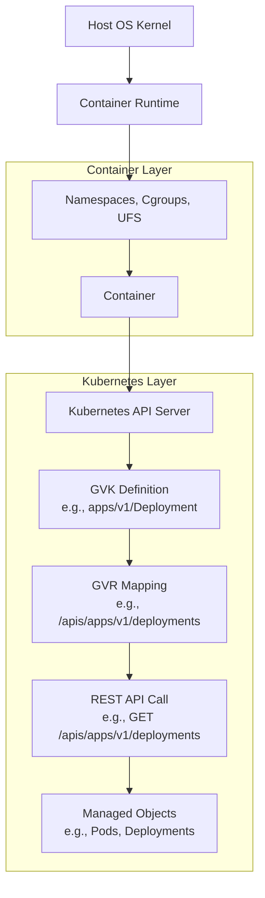

# Container Architecture and Kubernetes API

This README provides an overview of Linux container architecture (using namespaces, cgroups, and Union File Systems) and Kubernetes API conventions (GVK and GVR) for managing containerized workloads. It includes a Mermaid diagram to illustrate the flow from resource definition to API interaction.

## Table of Contents

- [Overview](#overview)
- [Key Components](#key-components)
  - [Container Architecture](#container-architecture)
  - [Kubernetes API (GVK/GVR)](#kubernetes-api-gvkgvr)
- [How It Works](#how-it-works)
- [Mermaid Diagram](#mermaid-diagram)
- [Use Case in DevOps](#use-case-in-devops)
- [References](#references)

## Overview

Containers leverage Linux kernel features (namespaces, cgroups, UFS) for isolation and efficiency. Kubernetes orchestrates these containers using a RESTful API, defined by GVK (Group, Version, Kind) and GVR (Group, Version, Resource), to manage objects like pods and deployments.

## Key Components

### Container Architecture

- **Linux Namespaces**: Isolate PID, network, filesystem, IPC, UTS, and users.
- **Control Groups (Cgroups)**: Limit and monitor CPU, memory, and I/O.
- **Union File Systems (UFS)**: Provide layered, efficient storage.

### Kubernetes API (GVK/GVR)

- **GVK**:
  - **Group**: API resource category (e.g., apps).
  - **Version**: API version (e.g., v1).
  - **Kind**: Object type (e.g., Deployment).
  - **Example**: apps/v1/Deployment.

- **GVR**:
  - Extends GVK with Resource (plural of Kind, e.g., deployments).
  - Used in REST endpoints (e.g., /apis/apps/v1/deployments).

- **REST Calls**: Plural forms enable CRUD operations via API endpoints.

## How It Works

- **Container Creation**: Namespaces, cgroups, and UFS create isolated containers.
- **Kubernetes Definition**: GVK defines resources in manifests (e.g., YAML).
- **API Mapping**: GVR translates to REST endpoints for interaction.
- **Orchestration**: Kubernetes API manages container lifecycles (e.g., scaling, updates).

## Mermaid Diagram

The following diagram illustrates the flow from container creation to Kubernetes API interaction:

### Explanation

*   The Host OS Kernel and Container Runtime create isolated containers using namespaces, cgroups, and UFS.
    
*   The Kubernetes API Server uses GVK to define resources and maps them to GVR for REST endpoints.
    
*   REST API Calls interact with managed objects (e.g., pods, deployments) for orchestration.
    

Use Case in DevOps
------------------

*   **Consistency**: Containers ensure uniform environments.
    
*   **Orchestration**: Kubernetes API enables automated scaling and updates.
    
*   **CI/CD Integration**: REST endpoints support pipeline automation.
    
*   **Cloud Deployment**: Scales containerized apps across clusters.
    

References
----------

*   [Docker Documentation](https://docs.docker.com/)
    
*   [Kubernetes API Documentation](https://kubernetes.io/docs/reference/generated/kubernetes-api/v1.27/)
    
*   [Linux Kernel Namespaces](https://man7.org/linux/man-pages/man7/namespaces.7.html)
