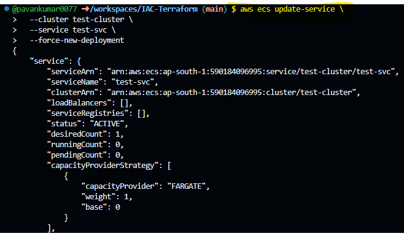

# Exec into ECS task running container
# Enabling and Using Amazon ECS Exec

Step 1: 
--
-  AWS CLI & Session Manager Plugin
- ```
Install the AWS CLI v2:

Verify the installation:

aws --version
If outdated, update AWS CLI.
Install the Session Manager Plugin for AWS CLI:

Download and install the plugin:

curl "https://s3.amazonaws.com/session-manager-downloads/plugin/latest/ubuntu_64bit/session-manager-plugin.deb" -o "session-manager-plugin.deb"
sudo dpkg -i session-manager-plugin.deb

Verify the installation:
session-manager-plugin --version
```
Step 2 :
--
- IAM Permissions

- ````
{
    "Version": "2012-10-17",
    "Statement": [
        {
            "Effect": "Allow",
            "Action": [
                "ecr:GetAuthorizationToken",
                "ecr:BatchCheckLayerAvailability",
                "ecr:GetDownloadUrlForLayer",
                "ecr:BatchGetImage",
                "logs:CreateLogStream",
                "logs:PutLogEvents",
                "ssmmessages:CreateControlChannel",
                "ssmmessages:CreateDataChannel",
                "ssmmessages:OpenControlChannel",
                "ssmmessages:OpenDataChannel",
                "ecs:ExecuteCommand"
            ],
            "Resource": "*"
        }
    ]
}

```

Step 3 :Enable ECS Exec in ECS
--
- aws ecs update-service \
  --cluster <cluster-name> \
  --service <service-name> \
  --enable-execute-command

Step 4 : Force a New Deployment
--
- aws ecs update-service \
  --cluster <cluster-name> \
  --service <service-name> \
  --force-new-deployment

Step 5 :Command to Execute Inside Container
-- 
- aws ecs list-tasks --cluster <cluster-name>

step 5 :

- Example
- aws ecs execute-command \
  --cluster test-cluster \
  --task  arn-policy\
  --container springboot-app \
  --interactive \
  --command "/bin/sh"

Demo :
--

Policy
--
- 
```
{
    "Version": "2012-10-17",
    "Statement": [
        {
            "Effect": "Allow",
            "Action": [
                "ssmmessages:CreateControlChannel",
                "ssmmessages:CreateDataChannel",
                "ssmmessages:OpenControlChannel",
                "ssmmessages:OpenDataChannel",
                "ssm:DescribeInstanceInformation",
                "ssm:GetConnectionStatus"
            ],
            "Resource": "*"
        },
        {
            "Effect": "Allow",
            "Action": [
                "ecs:ExecuteCommand"
            ],
            "Resource": "*"
        },
        {
            "Effect": "Allow",
            "Action": [
                "logs:CreateLogStream",
                "logs:PutLogEvents"
            ],
            "Resource": "*"
        }
    ]
}
```

Role
--
- 
- 
```
{
    "Version": "2012-10-17",
    "Statement": [
        {
            "Effect": "Allow",
            "Action": [
                "ecr:GetAuthorizationToken",
                "ecr:BatchCheckLayerAvailability",
                "ecr:GetDownloadUrlForLayer",
                "ecr:BatchGetImage",
                "logs:CreateLogStream",
                "logs:PutLogEvents",
                "ssmmessages:CreateControlChannel",
                "ssmmessages:CreateDataChannel",
                "ssmmessages:OpenControlChannel",
                "ssmmessages:OpenDataChannel",
                "ecs:ExecuteCommand"
            ],
            "Resource": "*"
        }
    ]
}
```

- COPY ARN OF THE ROLE 
- arn:aws:iam::590184096995:role/task-role-ecs

Update the task definiation with arn
--
```
{
    "family": "test-private",
    "containerDefinitions": [
        {
            "name": "springboot-app",
            "image": "pavan0077/spring-basic-docker:v1",
            "cpu": 0,
            "portMappings": [
                {
                    "name": "port-8123",
                    "containerPort": 8123,
                    "hostPort": 8123,
                    "protocol": "tcp",
                    "appProtocol": "http"
                }
            ],
            "essential": true,
            "environment": [],
            "mountPoints": [],
            "volumesFrom": [],
            "logConfiguration": {
                "logDriver": "awslogs",
                "options": {
                    "awslogs-group": "/ecs/test-private",
                    "mode": "non-blocking",
                    "awslogs-create-group": "true",
                    "max-buffer-size": "25m",
                    "awslogs-region": "ap-south-1",
                    "awslogs-stream-prefix": "ecs"
                }
            },
            "systemControls": []
        }
    ],
    "taskRoleArn": "arn:aws:iam::590184096995:role/task-role-ecs",
    "executionRoleArn": "arn:aws:iam::590184096995:role/ecsTaskExecutionRole",
    "networkMode": "awsvpc",
    "requiresCompatibilities": [
        "FARGATE"
    ],
    "cpu": "1024",
    "memory": "3072",
    "runtimePlatform": {
        "cpuArchitecture": "X86_64",
        "operatingSystemFamily": "LINUX"
    }
}
```
Commands
--
- aws ecs update-service   --cluster test-cluster   --service test-svc   --force-new-deployment
- aws ecs list-tasks --cluster test-cluster # List task id -- arn 
- aws ecs execute-command   --cluster test-cluster   --task arn:aws:ecs:ap-south-1:590184096995:task/test-cluster/e72595092de643bfb849243ba13f853c   --container springboot-app   --interactive   --command "/bin/sh"  #Exec

- 
- 
- 