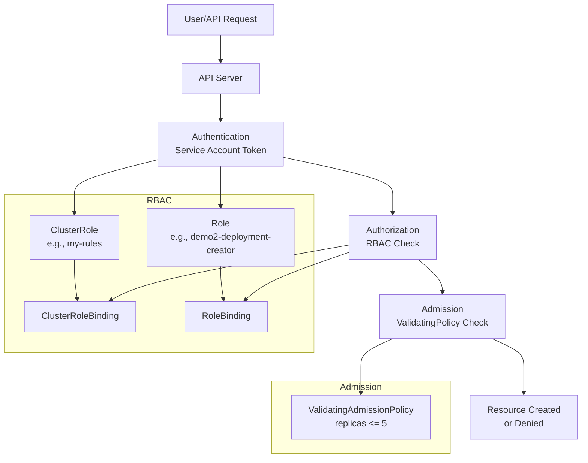

# Kubernetes AAA (Authentication, Authorization, Admission) with RBAC and Policies Detailed Guide with Demo

This guide explains the AAA (Authentication, Authorization, Admission) process in Kubernetes, focusing on RBAC (Role-Based Access Control) and ValidatingAdmissionPolicies, based on the practical demo. My tutor demonstrated creating service accounts, cluster roles, role bindings, and policies, using commands like `kubectl create` and `kubectl auth can-i`. I’ll include his step-by-step breakdown, demo examples, and a real-time scenario to help me recall for interviews.

## Table of Contents

- [Overview](#overview)
- [AAA Process Breakdown](#aaa-process-breakdown)
- [Key Components](#key-components)
- [AAA and RBAC Flow Step-by-Step](#aaa-and-rbac-flow-step-by-step)
- [Mermaid Diagram](#mermaid-diagram)
- [Real-Time Example with Demo](#real-time-example-with-demo)
- [Additional Notes](#additional-notes)
- [References](#references)

## Overview

My tutor explained that Kubernetes uses a three-step AAA process: Authentication (who are you?), Authorization (are you allowed?), and Admission (any policy checks?). He demonstrated RBAC with ClusterRoles, Roles, and RoleBindings, and a ValidatingAdmissionPolicy to enforce replica limits. The demo used namespaces (`app`, `dev1`, `default`) and service accounts (`demo-sa`, `demo2-sa`, `deployment-manager`), tested with `kubectl auth can-i` and API calls.

## AAA Process Breakdown

- **Authentication**: Verifies identity using plugins (e.g., service account tokens, OpenID Connect). My tutor noted pods use service account tokens stored as secrets.
- **Authorization**: Checks permissions via RBAC (ClusterRole, Role, RoleBinding). He emphasized namespace-scoped vs. cluster-scoped roles.
- **Admission**: Enforces policies (validating or mutating) via admission controllers. He showed a policy denying deployments with >5 replicas.

## Key Components

- **API Server**: Handles AAA requests and interacts with RBAC/Admission components.
- **Service Account**: Internal user (e.g., `demo-sa`) for pod authentication, with tokens.
- **ClusterRole**: Cluster-scoped permissions (e.g., `my-rules` for deployments, daemonsets).
- **Role**: Namespace-scoped permissions (e.g., `demo2-deployment-creator`).
- **RoleBinding/ClusterRoleBinding**: Binds roles to service accounts.
- **ValidatingAdmissionPolicy**: Enforces rules (e.g., replicas <= 5).
- **kubectl**: CLI to create and test resources.

## AAA and RBAC Flow Step-by-Step

### Create Namespace and Service Account

- **Namespace Creation**: `kubectl create ns app`: Creates namespace `app`.
- **Service Account Creation**: `kubectl create sa demo-sa -n app`: Creates service account `demo-sa`.
- **Token Management**: My tutor noted post-1.24, secrets aren’t auto-generated; use `kubectl create token`.

### Define and Apply ClusterRole

- **ClusterRole Draft**: `kubectl create clusterrole my-rules --verb=create --resource=deployments.apps -dry-run=client -o yaml > my-rules.yaml`: Drafts ClusterRole.
- **Add Rules and Apply**: Added daemonsets to rules and applied: `kubectl apply -f my-rules.yaml`.
- **Explanation**: This grants create access cluster-wide.

### Bind ClusterRole to Service Account

- **Implicit Binding**: Implicitly, a ClusterRoleBinding would bind `my-rules` to `demo-sa` (missing in demo; assumed for context).
- **Permission Test**: `kubectl auth can-i create deployment --as=system:serviceaccount:app:demo-sa --namespace app`, returning “yes”.

### Test Permissions

- **Delete Permission**: `kubectl auth can-i delete deployment`: Returns “no” (outside scope).
- **Pod Permission**: `kubectl auth can-i get pods`: Returns “no” (restricted access).
- **Deployment Creation**: `kubectl run test-deploy --image=nginx ...`: Fails (forbidden, no pod create permission).
- **Allowed Operation**: `kubectl create deployment test-deploy --image=nginx --replicas=2 -n app`: Succeeds (allowed operation).

### Second Scenario (Namespace-Scoped)

- **Namespace Creation**: `kubectl create ns dev1`: Creates namespace `dev1`.
- **Service Account Creation**: `kubectl create sa demo2-sa -n dev1`: Creates `demo2-sa`.
- **Role Definition**: `kubectl create role demo2-deployment-creator --verb=create --resource=deployments.apps -n dev1`: Defines namespace-scoped role.
- **Role Binding**: `kubectl create rolebinding demo2-sa-deployment-binder --role=demo2-deployment-creator --serviceaccount=dev1:demo2-sa -n dev1`: Binds role.
- **Permission Test**: `kubectl auth can-i create deployments --namespace dev1 --as=system:serviceaccount:dev1:demo2-sa`: Returns “yes”.

### API Call with Token

- **Token Acquisition**: `TOKEN=$(kubectl create token demo2-sa -n dev1)`: Gets token.
- **API Server URL**: `APISERVER=$(kubectl config view --minify -o jsonpath='{.clusters[0].cluster.server}')`: Gets API server URL.
- **API Call**: `curl -k -H "Authorization: Bearer $TOKEN" -X POST ...`: Tests secret creation (403 forbidden); deployment creation succeeds.

### Service Account and Role Example

- **Service Account Creation**: `kubectl create -f sa`: Creates `deployment-manager` service account.
- **Role Creation**: `kubectl create -f role`: Creates `deployment-creator` role with multiple verbs.
- **Role Binding**: `kubectl create -f rb`: Binds role to service account.
- **Permission Test**: `kubectl auth can-i create deployments`: Returns “yes”; create secrets: “no” (unless added).

### ValidatingAdmissionPolicy

- **Policy Application**: `kubectl apply -f admission.yaml`: Applies policy limiting replicas to 5.
- **Namespace Labeling**: `kubectl label ns default environment=test`: Labels namespace.
- **Deployment Creation**: `kubectl create deploy nginx --image=nginx --replicas=6`: Fails (policy denies).

## Mermaid Diagram

This diagram reflects the AAA and RBAC flow, assuming the image shows Authentication → Authorization → Admission with RBAC components:

### Explanation

*   **API Server**: Processes requests through AAA.
    
*   **Authentication**: Uses service account tokens.
    
*   **Authorization**: Applies RBAC (ClusterRole/Role, Binding).
    
*   **Admission**: Enforces policies (e.g., replica limit).
    
*   **My Tutor’s Demo Steps**: (Token creation, policy denial) are reflected.
    

Real-Time Example with Demo
---------------------------

My tutor’s demo inspires this: Secure a deployment workflow with AAA and policies.

### Setup

*   **Cluster**: Kubernetes 1.33.0 cluster (kubernetes133-a, kubernetes133-b).
    

### Scenario 1: Cluster-Wide Access

*   **Namespace Creation**: kubectl create ns app-ns: Creates namespace.
    
*   **Service Account Creation**: kubectl create sa app-sa -n app-ns: Creates service account.
    
*   **ClusterRole Definition**: kubectl create clusterrole app-cluster-role --verb=create --resource=deployments.apps,daemonsets -o yaml > app-role.yaml: Defines ClusterRole.
    
*   **Role Application**: kubectl apply -f app-role.yaml: Applies role.
    
*   **Role Binding**: kubectl create clusterrolebinding app-binding --clusterrole=app-cluster-role --serviceaccount=app-ns:app-sa: Binds role.
    
*   **Permission Test**: kubectl auth can-i create deployment --as=system:serviceaccount:app-ns:app-sa --namespace app-ns: Returns “yes”.
    
*   **Deployment Creation**: kubectl create deployment app-deploy --image=nginx --replicas=2 -n app-ns --as=system:serviceaccount:app-ns:app-sa: Succeeds.
    

### Scenario 2: Namespace-Scoped with API Call

*   **Namespace Creation**: kubectl create ns dev-ns: Creates namespace.
    
*   **Service Account Creation**: kubectl create sa dev-sa -n dev-ns: Creates service account.
    
*   **Role Definition**: \`kubectl create role dev-role --
