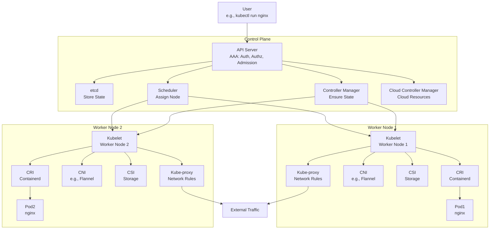

# Kubernetes Architecture and Request Flow Guide

This guide explains how Kubernetes works, from running workloads on virtual machines (VMs) or bare metal to managing requests through its architecture. It follows the lecture notes and aligns with the provided diagram, detailing the control plane, worker nodes, and how components like the API server, scheduler, kubelet, and kube-proxy interact. A step-by-step flow and real-world example are included.

## Table of Contents

- [Overview](#overview)
- [Kubernetes Setup](#kubernetes-setup)
- [Key Components](#key-components)
- [Request Flow Step-by-Step](#request-flow-step-by-step)
- [Mermaid Diagram](#mermaid-diagram)
- [Real-World Example](#real-world-example)
- [Additional Notes](#additional-notes)
- [References](#references)

## Overview

Kubernetes runs on VMs or bare metal infrastructure, managing containers across a cluster. It has a control plane node (the decision-maker) and worker nodes (where workloads run). All communication starts with a kubeconfig file, which kubectl uses to interact with the cluster. The architecture handles requests through components like the API server, scheduler, and kubelet, ensuring pods run smoothly.

## Kubernetes Setup

### Infrastructure

- **VMs or Bare Metal**: Kubernetes can run on VMs or bare metal.
- **Installation**: Kubernetes can be installed manually (e.g., with kubeadm) or via managed services (e.g., EKS).

### kubeconfig File

- **kubeadm**: Generates a kubeconfig file automatically (e.g., `~/.kube/config`).
- **Managed Services**: Provide a kubeconfig file.
- **kubectl**: Reads this file by default from `~/.kube/config` or from an exported `KUBECONFIG` environment variable (e.g., `export KUBECONFIG=/custom/path/config`).
- **Contents**: Contains cluster info, user details, and context for interaction.

## Key Components

- **API Server**: The entry point for all requests, handling authentication, authorization, and admission (AAA).
- **etcd**: A distributed key-value store (database) for cluster state, using Raft for leader election (e.g., 3 nodes, 2n+1 rule).

```
  https://medium.com/@extio/deep-dive-into-etcd-a-distributed-key-value-store-a6a7699d3abc
```
- **Scheduler**: Assigns pods to nodes based on resources, taints, tolerations, affinity, and node selectors.
- **Controller Manager (CCM)**: Ensures the desired state matches the actual state (e.g., 3 replicas running).
- **Cloud Controller Manager**: Manages cloud-specific resources (e.g., load balancer IPs).
- **Kubelet**: Runs on worker nodes, managing pods and talking to CRI, CNI, and CSI.
- **Kube-proxy**: Manages network rules (iptables, IPVS) for pod communication.
- **Containerd**: Runs containers, accessed via CRI.
- **CRI (Container Runtime Interface)**: Links kubelet to container runtimes (e.g., containerd).
- **CNI (Container Network Interface)**: Adds networking (e.g., Flannel, Calico).
- **CSI (Container Storage Interface)**: Handles storage.
- **Pods**: Run one or more containers.

## Request Flow Step-by-Step

### Request Starts

- **User Command**: A user runs a command like `kubectl run nginx --image=nginx`.
- **kubectl**: Uses the kubeconfig file to send the request to the API server.

### API Server Processing (AAA)

1. **Authentication**: Verifies the user with headers (e.g., ID card analogy: checks if you’re allowed in the building).
2. **Authorization**: Uses RBAC to check permissions (e.g., can you create a pod in the default namespace?).
3. **Admission**: Validates or mutates the request (e.g., adds labels via webhooks or checks image policies).
4. **etcd Storage**: The request is saved to etcd.

### etcd Storage

- **etcd**: Stores the pod spec as a key-value pair.
- **HA Mode**: In HA mode, 3 etcd nodes elect a leader using Raft. Backups can be saved to S3 (e.g., via a cron job: `etcdctl snapshot save | aws s3 cp`).

### Scheduler Assignment

- **Node Conditions**: The scheduler checks node conditions:
  - Taints/tolerations, affinity, node selectors, node name.
  - Resource availability (e.g., 500MB request vs. node capacity).
- **API Server Update**: It updates the API server with the node name (e.g., `worker-node-1`).

### Controller Manager Action

- **Desired State**: Ensures the desired state matches the actual state.
- **Example**: For a deployment with 3 replicas, it creates 3 pods.
- **Controllers**: Controllers (e.g., DaemonSet, StatefulSet) watch and adjust as needed.

### Kubelet on Worker Node

- **Kubelet**: On the assigned node (e.g., `worker-node-1`), the kubelet receives the pod spec.
- **Interactions**:
  - **CRI**: Tells containerd to run the nginx image.
  - **CNI**: Attaches a network (e.g., Flannel assigns an IP).
  - **CSI**: Manages storage if needed.

### Containerd and CRI

- **Containerd**: Pulls the nginx image and starts the container in the pod.

### Kube-proxy Network Rules

- **Kube-proxy**: Updates iptables or IPVS to allow pod communication.
- **Example**: Enables external access to nginx on port 80.

### Pod Running and Monitoring

- **Pod State**: The pod runs, and kubelet updates its state (e.g., “Running”) in etcd.
- **Kube-proxy**: Handles IP tables for each new pod.

### Cloud Controller Manager (if applicable)

- **Cloud Resources**: If a load balancer is created, CCM interacts with the cloud provider to assign an IP.

### Response to User

- **API Server Confirmation**: The API server confirms the pod is running (e.g., pod "nginx" created).

## Mermaid Diagram

This diagram shows the request flow based on the architecture:



### Explanation

*   The Control Plane (API server, etcd, scheduler, controller manager, CCM) manages decisions.
    
*   Worker Nodes (kubelet, CRI, CNI, CSI, kube-proxy) execute the work.
    
*   CRI runs containers via containerd, CNI handles networking, and CSI manages storage.
    

Real-World Example
------------------

Imagine deploying a multi-service e-commerce app (ecommerce-app) with a frontend and database:

### Request

**bash**Copy

Plain textANTLR4BashCC#CSSCoffeeScriptCMakeDartDjangoDockerEJSErlangGitGoGraphQLGroovyHTMLJavaJavaScriptJSONJSXKotlinLaTeXLessLuaMakefileMarkdownMATLABMarkupObjective-CPerlPHPPowerShell.propertiesProtocol BuffersPythonRRubySass (Sass)Sass (Scss)SchemeSQLShellSwiftSVGTSXTypeScriptWebAssemblyYAMLXML`   kubectl create deployment ecommerce-app --image=ecommerce-frontend:1.0 --replicas=2   `

Flow

1.  **User Command**: User runs the command using kubeconfig.
    
2.  **API Server**: Authenticates, authorizes, and saves to etcd.
    
3.  **Scheduler**: Assigns 2 pods to worker-node-1 and worker-node-2.
    
4.  **Controller Manager**: Ensures 2 pods run.
    
5.  **Kubelet**: On each node, uses CRI (containerd) to run ecommerce-frontend:1.0.
    
6.  **CNI**: (e.g., Flannel) assigns IPs; CSI adds storage if a database pod is added later.
    
7.  **Kube-proxy**: Enables external access.
    
8.  ``` kubectl create deployment db --image=mysql:5.7 --replicas=1 ```
    
9.  **Cloud Controller Manager**: (if on AWS) creates a load balancer for ecommerce-app.
    

### Complexity

*   Manages multiple services, networking, storage,
