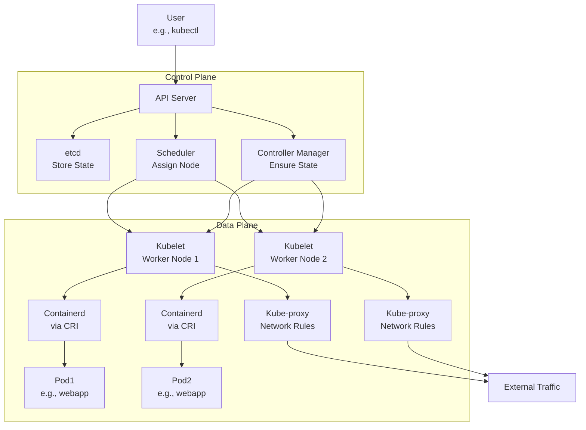

# Kubernetes Architecture and Request Flow Guide

This guide explains the Kubernetes architecture, detailing how a request flows through the system, what each component does, and how the control plane and data plane work together. It uses the provided diagram to create a step-by-step flow, including real-world examples like deploying a web application.

## Table of Contents

- [Overview](#overview)
- [Key Components](#key-components)
- [Request Flow Step-by-Step](#request-flow-step-by-step)
- [Mermaid Diagram](#mermaid-diagram)
- [Real-World Example](#real-world-example)
- [Additional Notes](#additional-notes)
- [References](#references)

## Overview

Kubernetes is a system to manage containers across many computers. It has a control plane (the brain) and a data plane (the workers). The diagram shows how requests move from a user to the API server, through schedulers and controllers, and finally to worker nodes where pods and containers run. Components like kubelet, kube-proxy, containerd, and CRI handle the heavy lifting.

## Key Components

- **API Server**: The entry point for all requests. It authenticates users, validates requests, and talks to etcd for data storage.
- **etcd**: A distributed key-value store that holds all cluster data (e.g., pod configs).
- **Scheduler**: Decides which worker node runs a pod based on resources and rules.
- **Controller Manager (CCM)**: Runs controllers to maintain the desired state (e.g., ensuring the right number of pods).
- **Kubelet**: An agent on worker nodes that ensures pods are running and healthy.
- **Kube-proxy**: Manages network rules to allow pod communication inside and outside the cluster.
- **Containerd**: A container runtime that pulls images and runs containers.
- **CRI (Container Runtime Interface)**: A standard way for kubelet to talk to container runtimes like containerd.
- **Pods**: The smallest unit, containing one or more containers.
- **Worker Nodes**: Machines that run pods and handle the workload.
- **Control Plane Node**: The machine hosting the control plane components.

## Request Flow Step-by-Step

### Request Starts

- **User Request**: A user (e.g., via `kubectl`) sends a request, like creating a deployment.
  - **Example**: `kubectl create deployment webapp --image=nginx`.

### Authentication with API Server

- **API Server**: The API server receives the request and checks the user’s identity using RBAC (Role-Based Access Control) with headers.
  - **If valid**: It processes the request.
  - **If not**: It rejects it.
  - **Note**: The diagram says, “User is authenticated with the headers passed. Save to etcd validate or update state.”

### Data Storage in etcd

- **etcd**: The API server saves the request details (e.g., deployment spec) to etcd, the cluster’s database.
  - **Purpose**: Ensures all components have the latest state.

### Scheduling by Scheduler

- **Scheduler**: The scheduler checks the request, looks at node resources (CPU, memory), and assigns the pod to a worker node.
  - **Note**: “Try to find the best fit node based on taints/tolerations, affinity, node selector & updates the pod spec with node name.”
  - **Example**: Assigns `webapp` pod to `worker-node-1` if it has enough resources.

### Controller Manager Action

- **Controller Manager**: Ensures the desired state matches the actual state.
  - **For a deployment**: It creates the right number of pods (e.g., 3 replicas).
  - **Note**: “Make sure actual state = desired state. Any issue tell API server what to do.”

### Kubelet on Worker Node

- **Kubelet**: The kubelet on the assigned worker node (e.g., `worker-node-1`) gets the pod spec from the API server.
  - **Action**: It uses CRI to tell containerd to pull the image (e.g., `nginx`) and start the container.
  - **Note**: Two kubelets are shown, managing `pod1` and `pod2` on different nodes.

### Containerd and CRI

- **Containerd**: Pulls the container image and runs it inside the pod.
  - **CRI**: Acts as the bridge between kubelet and containerd, ensuring compatibility.
  - **Example**: Containerd runs `nginx` in `pod1`.

### Network Management by Kube-proxy

- **Kube-proxy**: Sets up network rules (iptables or IPVS) to allow communication to and from pods.
  - **Note**: “kube-proxy maintains network rules on nodes. These network rules allow network communication to your Pods from network sessions inside or outside of your cluster.”
  - **Example**: Allows external traffic to reach `webapp` on port 80.

### Pod Creation and Monitoring

- **Kubelet**: Monitors the pod’s health and reports back to the API server.
  - **Note**: “Every time a pod is created the ip tables is handled by kube-proxy.”

### Response to User

- **API Server**: Confirms the deployment is created, and the user sees the result (e.g., deployment "webapp" created).

## Mermaid Diagram

This diagram shows the request flow:

### Explanation

*   The Control Plane (API server, etcd, scheduler, controller manager) handles requests and decisions.
    
*   The Data Plane (kubelet, containerd, kube-proxy, pods) executes the work on worker nodes.
    
*   Kube-proxy enables network access, and CRI links kubelet to containerd.
    

Real-World Example
------------------

Imagine deploying a multi-tier web application (ecommerce-app) with a frontend and backend:

### Request

**bash**Copy

Plain textANTLR4BashCC#CSSCoffeeScriptCMakeDartDjangoDockerEJSErlangGitGoGraphQLGroovyHTMLJavaJavaScriptJSONJSXKotlinLaTeXLessLuaMakefileMarkdownMATLABMarkupObjective-CPerlPHPPowerShell.propertiesProtocol BuffersPythonRRubySass (Sass)Sass (Scss)SchemeSQLShellSwiftSVGTSXTypeScriptWebAssemblyYAMLXML`   kubectl create deployment ecommerce-app --image=ecommerce-frontend:1.0 --replicas=2   `

### Flow

1.  **User Request**: Sent via kubectl.
    
2.  **API Server**: Authenticates and saves to etcd.
    
3.  **Scheduler**: Assigns 2 pods to worker-node-1 and worker-node-2 based on resource availability.
    
4.  **Controller Manager**: Ensures 2 pods are running.
    
5.  **Kubelet**: On each node, uses containerd (via CRI) to pull ecommerce-frontend:1.0 and start pods.
    
6.  **Kube-proxy**: Sets rules to allow external HTTP traffic (e.g., port 80).
    
7.  **User Check**: kubectl get pods shows 2 pods running.
    

### Complexity

Add a backend deployment:**bash**Copy

Plain textANTLR4BashCC#CSSCoffeeScriptCMakeDartDjangoDockerEJSErlangGitGoGraphQLGroovyHTMLJavaJavaScriptJSONJSXKotlinLaTeXLessLuaMakefileMarkdownMATLABMarkupObjective-CPerlPHPPowerShell.propertiesProtocol BuffersPythonRRubySass (Sass)Sass (Scss)SchemeSQLShellSwiftSVGTSXTypeScriptWebAssemblyYAMLXML`   kubectl create deployment ecommerce-backend --image=ecommerce-backend:1.0 --replicas=2   `

And a service:**bash**Copy

Plain textANTLR4BashCC#CSSCoffeeScriptCMakeDartDjangoDockerEJSErlangGitGoGraphQLGroovyHTMLJavaJavaScriptJSONJSXKotlinLaTeXLessLuaMakefileMarkdownMATLABMarkupObjective-CPerlPHPPowerShell.propertiesProtocol BuffersPythonRRubySass (Sass)Sass (Scss)SchemeSQLShellSwiftSVGTSXTypeScriptWebAssemblyYAMLXML`   kubectl expose deployment ecommerce-app --port=80 --type=LoadBalancer   `

*   **Scheduler**: Balances both frontend and backend pods.
    
*   **Kube-proxy**: Handles inter-pod communication.
    
*   **API Server**: Tracks all states.
    

Additional Notes
----------------

*   **Taints/Tolerations**: Used by the scheduler to avoid or allow nodes (e.g., mark a node as “noisy” and tolerate it for non-critical pods).
    
*   **CRI Alternatives**: Besides containerd, CRI-O is another runtime option.
    
*   **Time Context**: As of 04:52 PM IST on June 29, 2025, ensure your Kubernetes version supports the latest CRI features (e.g., 1.30).
    

References
----------

*   [Kubernetes Architecture](https://kubernetes.io/docs/concepts/overview/components/)
    
*   [Kubelet Documentation](https://kubernetes.io/docs/reference/command-line-tools-reference/kubelet/)
    
*   [Kube-proxy Documentation](https://kubernetes.io/docs/reference/command-line-tools-reference/kube-proxy/)
