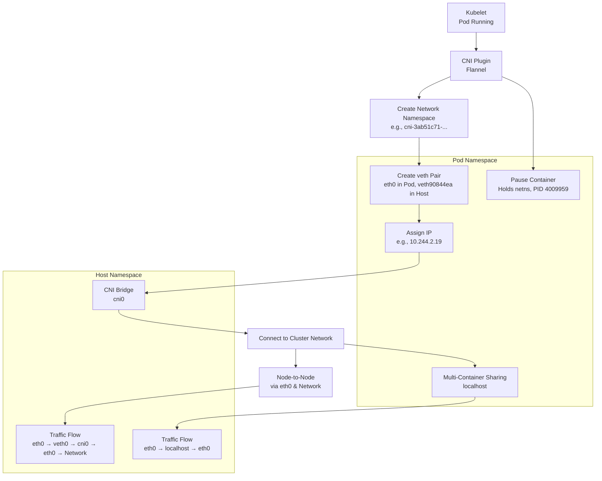

# Kubernetes CNI (Container Network Interface) Detailed Guide with Demo

This guide explains the CNI (Container Network Interface) in Kubernetes, based on my tutor’s lecture and the practical demo he conducted. It covers how CNI assigns IP addresses, sets up virtual Ethernet (veth) pairs, connects pods to the cluster network, and handles multi-container pods. My tutor emphasized CNI’s role with examples like `ip link show` and the shared-namespace pod, so I’ll include his step-by-step breakdown and analogies to help me ace interviews.

## Table of Contents

- [Overview](#overview)
- [What CNI Does](#what-cni-does)
- [Key Components of CNI](#key-components-of-cni)
- [CNI Flow Step-by-Step](#cni-flow-step-by-step)
- [Mermaid Diagram](#mermaid-diagram)
- [Real-Time Example with Demo](#real-time-example-with-demo)
- [Additional Notes](#additional-notes)
- [References](#references)

## Overview

My tutor said CNI is a Container Network Interface, a Cloud Native Computing Foundation project with a simple specification for plugins (e.g., Flannel). It focuses on container network connectivity—assigning IPs, setting up veth pairs, and cleaning up resources. He showed a demo on a self-managed cluster (`kubernetes133-a`, `kubernetes133-b`) with Flannel, using commands like `ip link` and `kubectl exec`, to explain how pods get networked, especially in multi-container setups.

## What CNI Does

- **Assigns IP Addresses**: Gives each pod a unique IP (e.g., `10.244.2.19`) from a CIDR range.
- **Sets Up veth Pairs**: Creates virtual Ethernet pairs between the pod and host namespaces.
- **Connects to Cluster Network**: Uses a bridge (e.g., `cni0`) or overlay for pod-to-pod and node-to-node routing.
- **Handles Multi-Container Pods**: Ensures all containers in a pod share one network namespace.
- **Cleans Up**: Removes network resources when a pod is deleted.
- **Integration**: Works with CoreDNS and kube-proxy for services and iptables.

## Key Components of CNI

- **Kubelet**: Triggers CNI after CRI sets up the pod.
- **CNI Plugin**: Implements networking (e.g., Flannel in the demo, shown as `flannel.1` and `cni0`).
- **Network Namespace**: A new netns created for each pod (e.g., `cni-3ab51c71-2856-1f60-81b2-052ae57c6bf3`).
- **veth Pair**: Links pod (`eth0`) to host (`veth90844ea@if2`), connected via the bridge.
- **CNI Bridge**: Routes traffic (e.g., `cni0` in the demo).
- **Pause Container**: Holds the network namespace (e.g., PID `4009959`).
- **CoreDNS**: Updates DNS for services (mentioned high-level).
- **kube-proxy**: Programs iptables (to be detailed later).

## CNI Flow Step-by-Step

### Pod Creation by Kubelet

- **User Command**: I run `kubectl apply -f multi.yaml` to create a pod with `busybox` (p1) and `nginx` (p2).
- **Kubelet Trigger**: Kubelet on `kubernetes133-b` triggers CNI after CRI makes it “Running.”

### CNI Creates Network Namespace

- **Namespace Creation**: CNI creates a new network namespace (e.g., `cni-3ab51c71-2856-1f60-81b2-052ae57c6bf3`).
- **Host Command**: My tutor showed this with `ip netns list` on the host.

### veth Pair Setup

- **veth Pair Creation**: CNI creates a veth pair: `eth0` in the pod namespace, `veth90844ea@if2` in the host namespace.
- **Host Command**: He demonstrated `ip link show` showing `veth90844ea` linked to the netns.

### IP Address Assignment

- **IPAM**: CNI assigns an IP (e.g., `10.244.2.19`) from the Flannel CIDR (e.g., `10.244.0.0/16`).
- **Confirmation**: My tutor confirmed this with `kubectl get pods -o wide`.

### Connection to CNI Bridge

- **Bridge Connection**: The host `veth0` connects to the `cni0` bridge, linking to the cluster network.
- **Host Command**: He showed `ip link` with `cni0` and `flannel.1` interfaces.

### Multi-Container Namespace Sharing

- **Namespace Sharing**: Both p1 and p2 share the same netns (held by the pause container, PID `4009959`).
- **Host Command**: My tutor used `lsns -p 4009959` to show net, UTS, and IPC namespaces.

### Pod-to-Pod Communication

- **Local Communication**: Inside the pod, p1 (`busybox`) accesses p2 (`nginx`) via `wget -qO- http://localhost`, returning the nginx welcome page.
- **Explanation**: They share the netns, using localhost.

### Node-to-Node Communication

- **Inter-Node Traffic**: For pods on different nodes, traffic goes `eth0 → veth0 → cni0 → node eth0 → network → other node eth0 → cni0 → veth0 → eth0`.
- **Tracing**: My tutor traced this with ARP tables on the bridge.

### Pause Container Role

- **Namespace Holder**: The pause container (PID `4009959`) holds the netns, ensuring stability for multi-container pods.
- **Host Command**: He showed `lsns` linking namespaces to this PID.

### Cleanup

- **Resource Removal**: When the pod deletes, CNI removes the veth pair and netns.

## Mermaid Diagram

This diagram follows my tutor’s demo flow:


### Explanation

*   **Kubelet Trigger**: Kubelet triggers CNI (Flannel) after pod creation.
    
*   **Namespace Setup**: CNI sets up a netns, veth pair, and IP, connecting via cni0.
    
*   **Pause Container**: Holds the netns for multi-container pods.
    
*   **Traffic Flow**: Traffic flows within the pod (localhost) or across nodes, as my tutor demoed.
    

Real-Time Example with Demo
---------------------------

My tutor’s demo inspires this: Deploy a multi-container pod (chat-room) and test CNI.

### Setup

*   **Cluster**: A self-managed cluster (kubernetes133-a, kubernetes133-b) with Flannel.
    

### Request

Create multi.yaml:

```
apiVersion: v1
kind: Pod
metadata:
  name: chat-room
spec:
  containers:
  - name: client
    image: busybox
    command: ['/bin/sh', '-c', 'sleep 10000']
  - name: server
    image: nginx

```
### Flow

1.  **Pod Creation**: Kubelet on kubernetes133-b runs the pod; CNI creates netns cni-xyz.
    
2.  **veth Pair Setup**: CNI sets up veth pair (e.g., eth0 in pod, veth123@if2 on host); I see this with ip link show.
    
3.  **IP Assignment**: CNI assigns IP (e.g., \`10.244.
