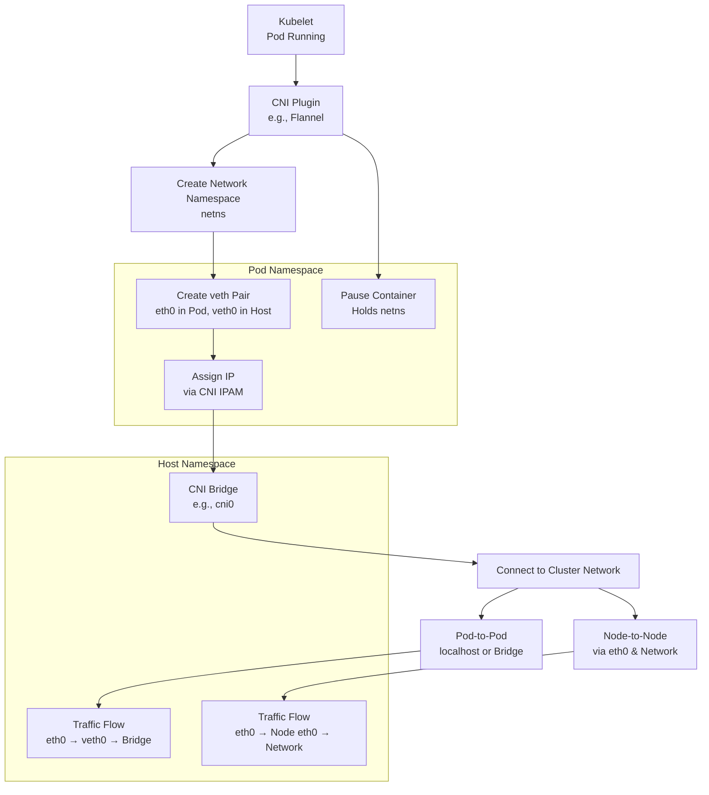

# Kubernetes CNI (Container Network Interface) Detailed Guide

This guide explains the CNI (Container Network Interface) in Kubernetes, as taught by my tutor. It covers what CNI does, how it assigns IP addresses, sets up virtual Ethernet pairs, and connects pods to the cluster network. My tutor emphasized CNI’s role in pod networking and its plugins (e.g., Flannel, Calico), so I’ll include his detailed breakdown, examples (e.g., `ip link`, pause container), and analogies to help me remember for interviews.

## Table of Contents

- [Overview](#overview)
- [What CNI Does](#what-cni-does)
- [Key Components of CNI](#key-components-of-cni)
- [CNI Flow Step-by-Step](#cni-flow-step-by-step)
- [Mermaid Diagram](#mermaid-diagram)
- [Real-Time Example](#real-time-example)
- [Additional Notes](#additional-notes)
- [References](#references)

## Overview

My tutor said CNI is a Container Network Interface, a Cloud Native Computing Foundation project with a simple specification and libraries for plugins. It focuses only on container network connectivity—assigning IPs, setting up virtual Ethernet (veth) pairs, and cleaning up when containers are deleted. He explained that CNI ensures pods get IPs and can communicate, using bridges or overlays, which is critical for deployments like those with three replicas.

## What CNI Does

- **Assigns IP Addresses**: Gives each pod a unique IP from a CIDR range I provide.
- **Sets Up veth Pairs**: Creates virtual Ethernet pairs between the pod and host namespaces.
- **Connects to Cluster Network**: Uses a bridge network or overlay (e.g., Flannel) for pod-to-pod and node-to-node communication.
- **Cleans Up**: Removes network resources when a pod is deleted.
- **Integration**: Works with CoreDNS and kube-proxy for services and iptables.

## Key Components of CNI

- **Kubelet**: Sends the pod request and triggers CNI after CRI sets up the container.
- **CNI Plugin**: Implements the specification (e.g., Flannel, Calico, Cilium) to handle networking.
- **Network Namespace**: A new namespace (netns) created for each pod by CNI.
- **veth Pair**: A pair of virtual Ethernet devices—one end in the pod namespace, one in the host namespace.
- **CNI Bridge**: Connects veth pairs to the cluster network, resolving traffic via ARP tables.
- **Pause Container**: Holds the network namespace (e.g., net, UTS, IPC) for the pod.
- **CoreDNS**: Watches services and updates DNS (my tutor mentioned this high-level).
- **kube-proxy**: Programs iptables for pod communication (detailed later by him).

## CNI Flow Step-by-Step

### Pod Creation by Kubelet

- **Kubelet Trigger**: After CRI (containerd, runC) makes the pod “Running,” kubelet triggers CNI.
- **Pod State**: The pod is ready but lacks an IP yet.

### CNI Creates Network Namespace

- **Namespace Creation**: CNI creates a new network namespace (netns) for the pod on the node.
- **Example**: On the host, `ip netns list` shows the new namespace.

### veth Pair Setup

- **veth Pair Creation**: CNI creates a virtual Ethernet pair (e.g., `veth0` on host, `eth0` in pod).
- **Namespace Assignment**: One end (`eth0`) is in the pod’s namespace; the other (`veth0`) is in the root namespace.
- **Example**: My tutor showed this with `ip link` on the host and `ip a` inside the pod.

### IP Address Assignment

- **IPAM**: CNI assigns an IP from the CIDR range (e.g., `10.244.0.0/16`) to the pod’s `eth0`.
- **Mechanism**: Done via the CNI IPAM (IP Address Management).

### Connection to CNI Bridge

- **Bridge Connection**: The host-side `veth0` connects to a CNI bridge (e.g., `cni0`).
- **Cluster Network**: The bridge links to the cluster network, enabling pod communication.

### Pod-to-Pod Communication

- **Same Node**: For pods on the same node, traffic goes `eth0 → veth0 → bridge → veth0 → eth0`.
- **Localhost**: They share the same namespace and use localhost.

### Node-to-Node Communication

- **Different Nodes**: For pods on different nodes, traffic goes `eth0 → veth0 → bridge → node eth0 → network → other node eth0 → bridge → veth0 → eth0`.
- **ARP Tables**: The bridge uses ARP tables to resolve destinations.

### Pause Container Role

- **Namespace Holder**: A pause container (a sleep process) holds the network namespace.
- **Namespace Linking**: My tutor said `lsns` shows net, UTS, and IPC namespaces linked to its PID.

### Cleanup

- **Resource Removal**: When the pod deletes, CNI removes the veth pair and IP.

## Mermaid Diagram

This diagram follows my tutor’s CNI flow:

### Explanation

*   **Kubelet Trigger**: Kubelet triggers CNI after pod creation.
    
*   **Namespace Setup**: CNI sets up a namespace, veth pair, and IP, connecting via a bridge.
    
*   **Pause Container**: Holds the namespace.
    
*   **Traffic Flow**: Traffic flows pod-to-pod or node-to-node, as my tutor detailed.
    

Real-Time Example
-----------------

My tutor’s style inspires this: Deploy a multi-pod app (chat-app) with CNI debugging.

### Request

Plain textANTLR4BashCC#CSSCoffeeScriptCMakeDartDjangoDockerEJSErlangGitGoGraphQLGroovyHTMLJavaJavaScriptJSONJSXKotlinLaTeXLessLuaMakefileMarkdownMATLABMarkupObjective-CPerlPHPPowerShell.propertiesProtocol BuffersPythonRRubySass (Sass)Sass (Scss)SchemeSQLShellSwiftSVGTSXTypeScriptWebAssemblyYAMLXML`   kubectl create deployment chat-app --image=chat-app:1.0 --replicas=2   `

Flow

1.  **Pod Creation**: Kubelet runs 2 pods via CRI; CNI creates netns for each.
    
2.  **veth Pair Setup**: CNI sets up veth pairs (e.g., eth0 in pod, veth0 on host) and assigns IPs (e.g., 10.244.1.2, 10.244.1.3).
    
3.  **Bridge Connection**: veth0 connects to the cni0 bridge; I check with ip link on the host.
    
4.  **Pod Communication**: Pods communicate via localhost (same node) or bridge (different nodes).
    
5.  **Add Busybox Pod**: kubectl run busybox --image=busybox; they share the netns.
    
6.  **Debugging**: I exec into a pod (kubectl exec -it chat-app-xxx -- /bin/sh) and run ip a to see eth0.
    
7.  **Cleanup**: CNI cleans up when I delete (kubectl delete pod chat-app-xxx).
    

Complexity

*   **Multi-Pod Setup**: Inter-node communication and debugging with ip commands, mirroring my tutor’s demo.
    

Additional Notes
----------------

*   **CNI Plugins**: My tutor listed Flannel, Calico, Cilium; choose during kubeadm.
    
*   **Pause Container**: He said it’s just a sleep container to hold namespaces—key for multi-container pods.
    
*   **Debugging**: Use ip netns exec or ip link as he showed.
    
*   **Time Context**: As of 09:45 PM IST, June 29, 2025, Kubernetes 1.30 supports advanced CNI plugins.
    

References
----------

*   [Kubernetes CNI](https://kubernetes.io/docs/concepts/extend-kubernetes/compute-storage-net/network-plugins/)
    
*   [CNI Specification](https://github.com/containernetworking/cni/blob/master/SPEC.md)
    
*   [Flannel Documentation](https://github.com/flannel-io/flannel)
