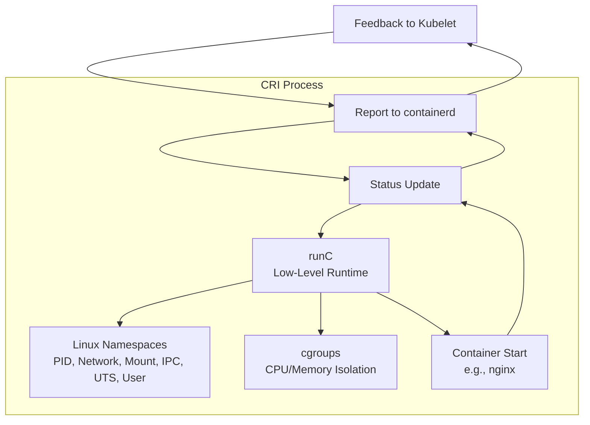

# Kubernetes CRI (Container Runtime Interface) Detailed Guide

This guide explains the CRI (Container Runtime Interface) in Kubernetes, as taught by my tutor. It covers how CRI works, its history, components like containerd and runC, and the step-by-step flow of running a container. My tutor emphasized CRI’s role in pod lifecycle management and its evolution from Docker, so I’ll include his examples and analogies (e.g., ID card, OCI spec) to help me remember for interviews.

## Table of Contents

- [Overview](#overview)
- [History and Evolution of CRI](#history-and-evolution-of-cri)
- [Key Components of CRI](#key-components-of-cri)
- [CRI Flow Step-by-Step](#cri-flow-step-by-step)
- [Mermaid Diagram](#mermaid-diagram)
- [Real-Time Example](#real-time-example)
- [Additional Notes](#additional-notes)
- [References](#references)

## Overview

My tutor said CRI is the Container Runtime Interface, a critical part of Kubernetes that lets kubelet talk to container runtimes. Before, requests went to a Docker shim, but now they go to containerd, then runC, which starts the container using Linux namespaces and cgroups. He explained that CRI came about because tying Kubernetes to Docker made the codebase heavy, leading to the OCI (Open Container Initiative) and lighter runtimes like containerd and gVisor.

## History and Evolution of CRI

### Docker Era

- **Kubernetes with Docker**: Kubernetes originally had Docker in its codebase. Every Kubernetes release depended on Docker features, making it slow and heavy.

### New Runtimes

- **Emergence of New Ideas**: Other ideas like rkt and lighter, more secure runtimes emerged, pushing for change.

### CRI Introduction

- **Kubernetes 1.2**: Core Docker was deprecated (though the Docker shim is maintained by Mirantis). CRI was coined in December 2016 to standardize runtimes.

### OCI Initiative

- **OCI Formation**: Docker and other companies started the OCI, splitting it into runtime (e.g., runC spec) and registry (image spec) standards. This freed Kubernetes from a single runtime.

### Modern Runtimes

- **Current Landscape**: Now, containerd is the industry standard, with options like gVisor, firecracker, and cri-o. These follow the OCI spec for starting, stopping, and deleting containers.

## Key Components of CRI

### Kubelet

- **Role**: Kubelet sends the request to run a pod (e.g., nginx) and uses CRI to do it.

### containerd

- **Role**: The CRI implementation that manages container lifecycle, images, and status. It has a daemon and tools like `ctr` or `nerdctl` for debugging.

### containerd Shim

- **Role**: A short-lived process that talks to runC, updates container status back to containerd, and can be replaced (e.g., with runwasi for WebAssembly).

### runC

- **Role**: The low-level runtime that creates Linux namespaces (PID, network, mount, etc.) and starts the container, then exits.

### Linux Namespaces

- **Details**: Inside the container, my tutor listed PID (process ID), root filesystem (mnt), network (eth0), IPC (shared memory), UTS (hostname), and User (root mapped to host user).

### cgroups

- **Role**: Handle CPU and memory isolation, part of the layering mechanism with namespaces.

## CRI Flow Step-by-Step

### Request from Kubelet

- **User Command**: I run `kubectl run nginx --image=nginx`, and kubelet gets the pod spec.
- **Kubelet Action**: Kubelet sends this to containerd via the CRI API.

### containerd Receives Request

- **containerd Role**: Containerd, as the CRI implementation, takes the request to manage the pod lifecycle (e.g., image pull, container start).

### containerd Shim Interaction

- **Shim Role**: The request goes to the containerd shim, a replaceable component. My tutor noted it can use runwasi for WebAssembly workloads.

### runC Executes

- **runC Role**: runC, the low-level runtime, creates Linux namespaces (PID, network, etc.) and cgroups for isolation.
- **Container Start**: It starts the nginx container and exits as a short-lived process.

### Status Update

- **Status Flow**: The containerd shim updates containerd with the container’s status (e.g., “Running”).

### Pod Lifecycle Management

- **containerd Management**: Containerd handles image management, exec, logs, and attach operations.
- **CRI Role**: CRI manages the full pod-container lifecycle.

### Feedback to Kubelet

- **Status Report**: Kubelet gets the status update and reports back to the API server, which saves it to etcd.

## Mermaid Diagram

This diagram follows my tutor’s CRI flow:

### Explanation

*   **Kubelet**: Initiates the request.
    
*   **containerd**: Manages it via CRI.
    
*   **containerd Shim**: Bridges to runC, which uses namespaces and cgroups.
    
*   **Status Flow**: Status flows back to kubelet, aligning with my tutor’s step-by-step.
    

Real-Time Example
-----------------

My tutor’s style inspires this: Deploy a microservices app (user-service) with CRI debugging.

### Request

Plain textANTLR4BashCC#CSSCoffeeScriptCMakeDartDjangoDockerEJSErlangGitGoGraphQLGroovyHTMLJavaJavaScriptJSONJSXKotlinLaTeXLessLuaMakefileMarkdownMATLABMarkupObjective-CPerlPHPPowerShell.propertiesProtocol BuffersPythonRRubySass (Sass)Sass (Scss)SchemeSQLShellSwiftSVGTSXTypeScriptWebAssemblyYAMLXML`   kubectl run user-service --image=user-service:1.0   `

Flow

1.  **Kubelet Request**: Kubelet sends the request to containerd via CRI.
    
2.  **containerd Pulls Image**: Containerd pulls user-service:1.0 and passes it to the containerd shim.
    
3.  **Shim Calls runC**: Shim calls runC, which creates namespaces (e.g., PID 1 for user-service, eth0 network) and cgroups (limits to 500MB).
    
4.  **runC Starts Container**: runC starts the container and exits; shim updates containerd.
    
5.  **Debugging**: I debug with ctr containers list to see the running container.
    
6.  **Status Confirmation**: Kubelet confirms “Running” to the API server.
    

Complexity

Add a second pod (auth-service) and use nerdctl to check logs, mimicking a real microservices setup with CRI troubleshooting.

Additional Notes
----------------

### CRI Tools

*   **Tools**: My tutor mentioned ctr, nerdctl, and crictl for debugging.
    
    *   **Example**: ctr image pull nginx or nerdctl logs user-service.
        

### Shim Flexibility

*   **Replaceability**: The shim’s replaceability (e.g., runwasi) allows WebAssembly, a future trend.
    

### OCI Impact

*   **Runtime Agnosticism**: CRI’s OCI alignment (since 2016) makes Kubernetes runtime-agnostic.
    

### Time Context

*   **Current State**: As of 09:25 PM IST, June 29, 2025, containerd is standard in Kubernetes 1.30, with gVisor gaining traction.
    

References

*   [Kubernetes CRI](https://kubernetes.io/docs/concepts/containers/runtime-class/)
    
*   [containerd Documentation](https://containerd.io/)
    
*   [OCI Specification](https://opencontainers.org/)
