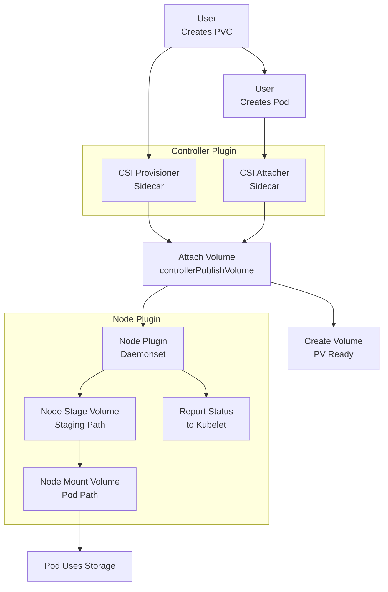

# Kubernetes CSI (Container Storage Interface) Detailed Guide

This guide explains the CSI (Container Storage Interface) in Kubernetes, as taught by my tutor. It covers how CSI provisions persistent storage for pods, its evolution from in-tree drivers, and the roles of controller and node plugins. My tutor emphasized CSI’s GA in Kubernetes 1.13 and its use with stateful sets, so I’ll include his step-by-step breakdown and examples (e.g., PVC, sidecar containers) to help me recall for interviews.

## Table of Contents

- [Overview](#overview)
- [History and Evolution of CSI](#history-and-evolution-of-csi)
- [Key Components of CSI](#key-components-of-csi)
- [CSI Flow Step-by-Step](#csi-flow-step-by-step)
- [Mermaid Diagram](#mermaid-diagram)
- [Real-Time Example](#real-time-example)
- [Additional Notes](#additional-notes)
- [References](#references)

## Overview

My tutor said CSI is the Container Storage Interface, which went GA in Kubernetes 1.13 and is now standard by 1.33, deprecating most in-tree storage drivers. It allows pods to use persistent storage for stateful sets or other needs. He explained that CSI moves storage drivers outside Kubernetes, using a gRPC API, with controller and node plugins handling volume management.

## History and Evolution of CSI

### Pre-CSI Era

- **In-Tree Drivers**: Before CSI, storage vendors built drivers inside Kubernetes, tying new features to Kubernetes releases, causing delays.

### CSI Introduction

- **GA in 1.13**: CSI was introduced and went GA in Kubernetes 1.13, externalizing drivers and communicating via a well-defined gRPC API.

### Modern State

- **Standardization**: By Kubernetes 1.33 (as of today, 05:22 PM IST, July 05, 2025), most cloud providers use CSI, making it the standard for storage.

## Key Components of CSI

- **Kubelet**: Triggers the node plugin to mount volumes into pods.
- **Controller Plugin**: Manages volume lifecycle with three sidecars:
  - **CSI Provisioner**: Watches PVCs, creates/deletes volumes.
  - **CSI Attacher**: Attaches/detaches volumes to nodes.
  - **CSI Snapshotter**: Handles snapshots (if enabled).
- **Node Plugin**: Runs as a daemonset, mounting/unmounting volumes and reporting disk status.
- **Storage Class**: Defines the CSI driver for a PVC.
- **Persistent Volume Claim (PVC)**: Requests storage, backed by a storage class.
- **Persistent Volume (PV)**: Represents the created volume.
- **CSI Driver**: Talks to the cloud backend (e.g., AWS EBS) via APIs.

## CSI Flow Step-by-Step

### User Creates PVC

- **PVC Creation**: I create a PVC with a storage class (e.g., aws-ebs).
- **Trigger CSI**: My tutor said this triggers the CSI process.

### CSI Provisioner Watches PVC

- **Provisioner Detection**: The provisioner (sidecar) detects the PVC and calls `createVolume` on the CSI driver.
- **Watch PVC**: He noted it watches for PVC creation/deletion.

### CSI Driver Creates Volume

- **Volume Creation**: The driver (e.g., AWS EBS) creates the volume on the cloud and returns a PV.
- **PV Ready**: The PV is marked “ready” but not yet attached.

### User Creates Pod

- **Pod Deployment**: I deploy a pod referencing the PVC.
- **Pod Scheduling**: My tutor said this schedules the pod on a node.

### CSI Attacher Attaches Volume

- **Volume Attachment**: The attacher (sidecar) calls `controllerPublishVolume` to attach the volume to the node where the pod runs.
- **Node Matching**: He emphasized matching node and pod location.

### Node Plugin Stages Volume

- **Volume Staging**: The node plugin (daemonset) calls `nodeStageVolume` to prepare the block device at a staging path.
- **Staging Path**: My tutor said this happens on the pod’s node.

### Node Plugin Mounts Volume

- **Volume Mounting**: The node plugin mounts the volume into the pod at the specified path.
- **Filesystem Formatting**: He explained it formats the filesystem if needed.

### Pod Uses Storage

- **Storage Access**: The pod accesses the persistent storage (e.g., for a database).
- **Status Reporting**: Status is reported back to kubelet.

### Cleanup (Optional)

- **Resource Deletion**: When the pod or PVC deletes, the attacher detaches, and the provisioner deletes the volume.
- **Snapshot Handling**: Snapshotter handles snapshots if enabled.

## Mermaid Diagram

This diagram follows my tutor’s CSI flow:



### Explanation

*   **User Initiation**: User initiates with PVC and pod creation.
    
*   **Controller Plugin**: (provisioner, attacher) manages volume creation and attachment.
    
*   **Node Plugin**: Stages and mounts the volume.
    
*   **My Tutor’s Steps**: (e.g., staging path, gRPC) are reflected.
    

Real-Time Example
-----------------

My tutor’s style inspires this: Deploy a stateful MySQL app with CSI.

### Setup

*   **Cluster**: Kubernetes 1.33.0 cluster with AWS EBS CSI driver.
    

### Request

Create storage.yaml:

```
apiVersion: storage.k8s.io/v1
kind: StorageClass
metadata:
  name: ebs-sc
provisioner: ebs.csi.aws.com
---
apiVersion: v1
kind: PersistentVolumeClaim
metadata:
  name: mysql-pvc
spec:
  storageClassName: ebs-sc
  accessModes:
    - ReadWriteOnce
  resources:
    requests:
      storage: 10Gi

```

Apply:

```
kubectl apply -f storage.yaml
```

Create mysql-pod.yaml:

```
apiVersion: v1
kind: Pod
metadata:
  name: mysql-pod
spec:
  containers:
  - name: mysql
    image: mysql:5.7
    env:
    - name: MYSQL_ROOT_PASSWORD
      value: password
    volumeMounts:
    - mountPath: "/var/lib/mysql"
      name: mysql-data
  volumes:
  - name: mysql-data
    persistentVolumeClaim:
      claimName: mysql-pvc

```
Apply:

```
kubectl apply -f mysql-pod.yaml
```

1.  **PVC Creation**: I create the PVC; CSI provisioner watches and calls createVolume on the AWS EBS driver.
    
2.  **Volume Creation**: Driver creates a 10Gi EBS volume; PV is ready.
    
3.  **Pod Deployment**: I deploy the pod; CSI attacher attaches the volume to the node.
    
4.  **Volume Staging**: Node plugin stages (e.g., /var/lib/kubelet/plugins) and mounts it to /var/lib/mysql.
    
5.  **Pod Execution**: Pod runs MySQL; I verify with kubectl exec -it mysql-pod -- mysql -u root -ppassword.
    
6.  **Resource Deletion**: Delete: kubectl delete -f mysql-pod.yaml; attacher detaches, provisioner deletes.
    

### Complexity

*   **Persistent Storage**: For a stateful app, matching my tutor’s stateful set focus.
    

Additional Notes
----------------

*   **CSI Drivers**: My tutor said most cloud providers (e.g., AWS, GCP) use CSI by 1.33.
    
*   **Sidecars**: Provisioner, attacher, and snapshotter are key; enable snapshotter for backups.
    
*   **Debugging**: Check pod events (kubectl describe pod mysql-pod) or node logs.
    
*   **Time Context**: As of 05:22 PM IST, July 05, 2025, Kubernetes 1.33.0 is current, aligning with his demo context.
    

References

*   [Kubernetes CSI](https://kubernetes.io/docs/concepts/storage/csi/)
    
*   [CSI Specification](https://github.com/container-storage-interface/spec/blob/master/spec.md)
    
*   [AWS EBS CSI Driver](https://github.com/kubernetes-sigs/aws-ebs-csi-driver)
