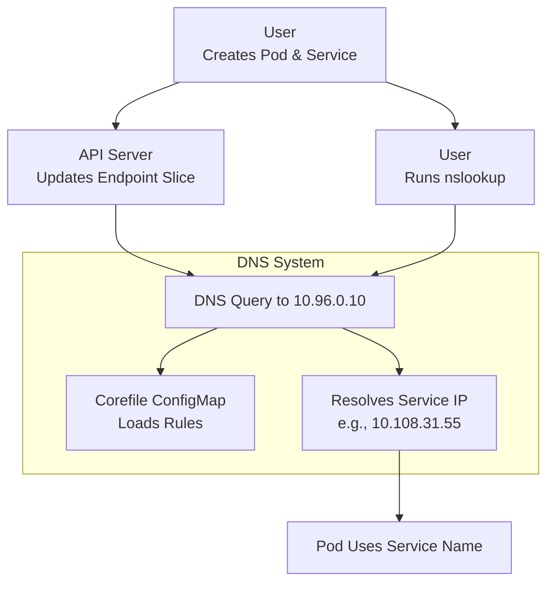

# Kubernetes CoreDNS Detailed Guide with Demo

This guide explains CoreDNS in Kubernetes, based on the practical demo conducted. It covers how CoreDNS provides service discovery, resolves service names to IPs, and integrates with the cluster’s DNS system. My tutor emphasized CoreDNS’s role in the kube-system namespace and demonstrated it with nslookup and service creation, so I’ll include his step-by-step breakdown and examples to help me recall for interviews.

## Table of Contents

- [Overview](#overview)
- [What CoreDNS Does](#what-coredns-does)
- [Key Components of CoreDNS](#key-components-of-coredns)
- [CoreDNS Flow Step-by-Step](#coredns-flow-step-by-step)
- [Mermaid Diagram](#mermaid-diagram)
- [Real-Time Example with Demo](#real-time-example-with-demo)
- [Additional Notes](#additional-notes)
- [References](#references)

## Overview

My tutor said CoreDNS is a critical service discovery mechanism in Kubernetes, running in the kube-system namespace as a ConfigMap. It resolves service names (e.g., `nginx-service.default.svc.cluster.local`) to cluster IPs (e.g., `10.108.31.55`) and handles pod DNS queries. He showed a demo on a self-managed cluster (`kubernetes133-a`, `kubernetes133-b`) with Flannel, using `kubectl run` and `nslookup` to test resolution.

## What CoreDNS Does

- **Service Discovery**: Maps service names to cluster IPs for pod communication.
- **DNS Resolution**: Responds to queries (e.g., `nslookup nginx-service`) with service IPs.
- **Configurability**: Uses a Corefile for settings like TTL, caching, and forwarding.
- **Integration**: Works with kube-dns service (cluster IP `10.96.0.10`) and endpoint slices.
- **Role**: My tutor highlighted its role in making services accessible via DNS names.

## Key Components of CoreDNS

- **CoreDNS Pod**: Runs in kube-system, managed by a deployment.
- **Corefile ConfigMap**: Defines DNS behavior (e.g., kubernetes plugin, forwarding).
- **kube-dns Service**: Cluster IP (`10.96.0.10`) for DNS queries.
- **Endpoint Slice**: Maps services to pod IPs, updated by the API server.
- **Pod**: Queries DNS (e.g., busybox with `nslookup`).
- **API Server**: Provides service and endpoint data to CoreDNS.

## CoreDNS Flow Step-by-Step

### User Creates Pod and Service

- **Pod and Service Creation**: I apply `nginx.yaml` to create an nginx pod and service.
- **Service Setup**: My tutor noted this sets up the service with cluster IP `10.108.31.55`.

### API Server Updates Endpoint Slice

- **Endpoint Mapping**: The API server maps `nginx-service` to the pod’s IP (e.g., assigned by CNI).
- **Verify Endpoint Slice**: He implied this via `kubectl get endpointslice`.

### CoreDNS Configures Resolution

- **CoreDNS Running**: CoreDNS, running with the kube-dns service (`10.96.0.10`), loads the Corefile.
- **Service Watch**: It watches for service changes and prepares to resolve `nginx-service.default.svc.cluster.local`.

### User Runs DNS Query

- **DNS Query**: I run `kubectl run -it --rm busybox --image=busybox --restart=Never -- sh` and use `nslookup nginx-service`.
- **Initial Errors**: My tutor showed initial NXDOMAIN errors due to timing or misconfiguration.

### CoreDNS Resolves Query

- **Query Handling**: CoreDNS receives the query, checks the kubernetes plugin, and returns `10.108.31.55` for `nginx-service.default.svc.cluster.local`.
- **Correct Resolution**: He demonstrated the correct resolution after service stabilization.

### Pod Uses Resolved IP

- **Service Access**: The busybox pod can now access nginx via the service name.
- **Confirm Access**: My tutor confirmed this with the demo output.

### Cleanup (Optional)

- **Resource Deletion**: When the pod or service deletes, CoreDNS updates its records.
- **Flow Context**: He implied this in the flow’s context.

## Mermaid Diagram

This diagram follows my tutor’s demo flow:


### Explanation

*   **User Initiation**: User initiates with pod and service creation.
    
*   **API Server Update**: API Server updates endpoint slices.
    
*   **CoreDNS Resolution**: CoreDNS resolves queries using the Corefile and kube-dns service.
    
*   **My Tutor’s Focus**: Demo focus on nslookup is reflected.
    

Real-Time Example with Demo
---------------------------

My tutor’s demo inspires this: Set up a web service (web-app) with CoreDNS.

### Setup

*   **Cluster**: Kubernetes 1.33.0 cluster (kubernetes133-a, kubernetes133-b) with Flannel.
    

### Pod and Service

Create web-app.yaml:
```
apiVersion: v1
kind: Pod
metadata:
  name: web-app
  labels:
    app: web
spec:
  containers:
  - name: web
    image: nginx
---
apiVersion: v1
kind: Service
metadata:
  name: web-service
spec:
  selector:
    app: web
  ports:
  - protocol: TCP
    port: 80
    targetPort: 80

```

Apply:
```
kubectl apply -f web-app.yaml
```

Flow

1.  **Pod Running**: Pod runs on kubernetes133-b with IP 10.244.2.21 (check kubectl get pods -o wide).
    
2.  **Service Setup**: Service gets cluster IP 10.108.32.100 (check kubectl get svc).
    
3.  **Busybox Pod**: I run a busybox pod: kubectl run -it --rm busybox --image=busybox --restart=Never -- sh.
    
4.  **DNS Testing**: I test DNS: nslookup web-service; initial NXDOMAIN may occur due to cache or timing.
    
5.  **Stable Resolution**: After stabilization, nslookup web-service.default.svc.cluster.local returns 10.108.32.100.
    
6.  **Service Access**: I verify access: wget -qO- http://web-service gets the nginx page.
    
7.  **Resource Deletion**: Delete: kubectl delete -f web-app.yaml; busybox exits.
    

### Complexity

*   **Service Discovery**: DNS resolution and demo-style testing with nslookup, matching my tutor’s approach.
    

Additional Notes
----------------

*   **ConfigMap**: My tutor’s Corefile sets TTL (30s), caching, and forwarding to /etc/resolv.conf.
    
*   **Debugging**: Use kubectl get configmap -n kube-system coredns -o yaml and nslookup as he demoed.
    
*   **Limitations**: NXDOMAIN may occur if services aren’t fully registered; retry helps.
    
*   **Time Context**: As of 06:15 PM IST, July 05, 2025, Kubernetes 1.33.0 is current, aligning with his demo.
    

References

*   [Kubernetes CoreDNS](https://kubernetes.io/docs/concepts/services-networking/dns-pod-service/)
    
*   [CoreDNS Documentation](https://coredns.io/)
    
*   [kube-dns Service](https://kubernetes.io/docs/concepts/services-networking/service/)
