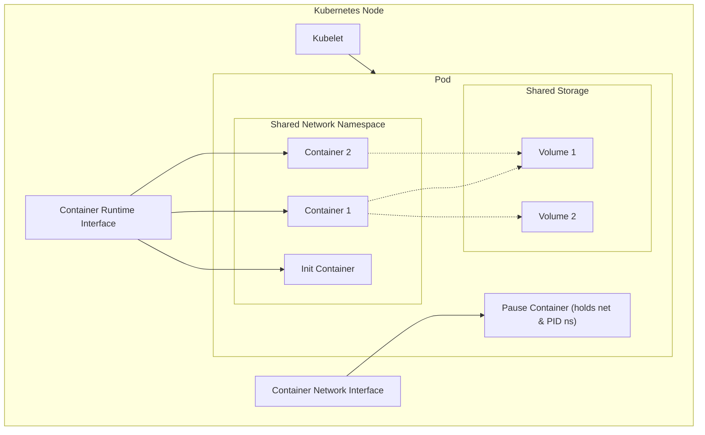

# Kubernetes Pods – 100 % in-file Deep-Dive Guide  

---

## 1. Introduction
Kubernetes **Pods** are the smallest deployable compute units.  
- One or more containers share **network**, **PID**, **IPC**, **volumes** and the **same lifecycle**.  
- They are **scheduled together on one node** and **started/stopped as a group**.

---

## 2. Architecture & Components

### 2.1 Logical View

### 2.2 Creation Flow


### 3. Pod Lifecycle
### 3.1 States


### 3.2 Conditions (K8s 1.33+)

| Type                        | Meaning                             |
| --------------------------- | ----------------------------------- |
| `PodReadyToStartContainers` | Sandbox ready, init containers done |
| `Initialized`               | All init containers completed       |
| `Ready`                     | Pod is ready to serve traffic       |
| `ContainersReady`           | All containers are ready            |
| `PodScheduled`              | Node assignment complete            |

### 4. Multi-Container Patterns
### 4.1 Init Containers
### Run sequentially before app containers.

```
apiVersion: v1
kind: Pod
metadata:
  name: web-with-init
spec:
  volumes:
  - name: shared
    emptyDir: {}
  initContainers:
  - name: fetch
    image: busybox
    command: ['sh','-c','wget -O /work/index.html http://kubesimplify.com']
    volumeMounts:
    - name: shared
      mountPath: /work
  containers:
  - name: nginx
    image: nginx
    volumeMounts:
    - name: shared
      mountPath: /usr/share/nginx/html
```

### 4.2 Sidecar Containers (K8s 1.33+)
### Set restartPolicy: Always inside initContainers.

```
apiVersion: v1
kind: Pod
metadata:
  name: sidecar-demo
spec:
  volumes:
  - name: shared
    emptyDir: {}
  initContainers:
  - name: metrics-exporter
    image: prom/node-exporter
    restartPolicy: Always          # ← native sidecar
    volumeMounts:
    - name: shared
      mountPath: /shared
  containers:
  - name: app
    image: my-app
    volumeMounts:
    - name: shared
      mountPath: /shared
```
### 5. Container Probes


```
startupProbe:
  httpGet:
    path: /ready
    port: 8080
  failureThreshold: 30
  periodSeconds: 10
livenessProbe:
  httpGet:
    path: /health
    port: 8080
  initialDelaySeconds: 60
  periodSeconds: 30
readinessProbe:
  httpGet:
    path: /ready
    port: 8080
  initialDelaySeconds: 5
  periodSeconds: 5
```

### 6. Real-World YAML Examples
### 6.1 E-commerce Microservice

```
apiVersion: v1
kind: Pod
metadata:
  name: checkout-service
spec:
  initContainers:
  - name: db-migrate
    image: checkout/migrate:v2.1
  containers:
  - name: app
    image: checkout/api:v2.1
    ports:
    - containerPort: 8080
    resources:
      requests: {cpu: "500m", memory: "512Mi"}
      limits:   {cpu: "1000m", memory: "1Gi"}
  - name: redis-cache
    image: redis:7-alpine
    ports:
    - containerPort: 6379
```
### 6.2 ML Training Job (GPU)

```
apiVersion: v1
kind: Pod
metadata:
  name: ml-training
spec:
  restartPolicy: Never
  nodeSelector:
    accelerator: nvidia-tesla-v100
  containers:
  - name: trainer
    image: tensorflow/tensorflow:2.13.0-gpu
    resources:
      requests:
        nvidia.com/gpu: 2
        memory: 8Gi
        cpu: 4
      limits:
        nvidia.com/gpu: 2
        memory: 16Gi
        cpu: 8
    volumeMounts:
    - name: data
      mountPath: /data
    - name: models
      mountPath: /models
  volumes:
  - name: data
    persistentVolumeClaim: {claimName: training-data}
  - name: models
    persistentVolumeClaim: {claimName: model-output}
```

### 7. Advanced Concepts
### 7.1 Graceful Shutdown Flow


### 7.2 QoS Classes

| Class          | Rule                                | Example                           |
| -------------- | ----------------------------------- | --------------------------------- |
| **Guaranteed** | `request == limit` for CPU & memory | `cpu: "500m"` / `memory: "512Mi"` |
| **Burstable**  | at least one `request < limit`      | `cpu: "250m"` / `memory: "1Gi"`   |
| **BestEffort** | no requests/limits at all           | `{}`                              |

### 8. Security Best Practices

```
securityContext:
  runAsNonRoot: true
  runAsUser: 1001
  allowPrivilegeEscalation: false
  readOnlyRootFilesystem: true
  capabilities:
    drop: ["ALL"]
```

### 9. Troubleshooting Cheat-Sheet

| Symptom              | Commands                                        |
| -------------------- | ----------------------------------------------- |
| **Pending**          | `kubectl describe pod <name>`                   |
| **CrashLoopBackOff** | `kubectl logs <pod> --previous`                 |
| **Not Ready**        | `kubectl get events --sort-by='.lastTimestamp'` |
| **Network**          | `kubectl exec -it <pod> -- curl <service>`      |
| **Debug**            | `kubectl debug <pod> -it --image=busybox`       |

### 10. Quick Reference YAML Files
### 10.1 Basic Pod

```
apiVersion: v1
kind: Pod
metadata:
  name: nginx
spec:
  containers:
  - name: nginx
    image: nginx:1.21
    ports:
    - containerPort: 80
```

### 10.2 Pod with Probes

```
apiVersion: v1
kind: Pod
metadata:
  name: nginx-probes
spec:
  containers:
  - name: nginx
    image: nginx
    startupProbe:
      httpGet: {path: /, port: 80}
    livenessProbe:
      httpGet: {path: /, port: 80}
    readinessProbe:
      httpGet: {path: /, port: 80}
```

### 11. Summary


# Kubernetes Pods – Complete Tutorial Transcript + Deep-Dive Guide  
*(copy-paste ready, GitHub friendly)*

> **All spoken lines from the tutor’s video are preserved inline and highlighted.**  
> All diagrams, YAML and best-practice content are folded into this single file.

---

## 0. Tutor’s Opening Lines (exact transcript)
> “Today we’ll cover the smallest deployable unit in Kubernetes — the **Pod**.  
> We’ll see how the **kubelet** talks to **CRI (Container Runtime Interface)** to pull images, start containers, and then how **CNI (Container Network Interface)** attaches the network interface and assigns the **Pod IP**.  
> You’ll learn the five Pod conditions, the four restart-policy values, the three QoS classes, and the **new sidecar feature in 1.33**.”

---

## 1. What Exactly Is a Pod?
- **Smallest deployable unit** in Kubernetes.  
- A **sandbox** (pause container) is created first; all user containers share its **network namespace** and **PID namespace**.  
- **Containers inside a Pod**:
  - share **localhost**  
  - share **volumes**  
  - share **lifecycle**  
  - **co-located on the same node**  

> “Pods are *ephemeral* — they come and go; if one dies, a new one (with a new IP) is created.”

---

## 2. Pod Creation Flow (verbatim tutor walk-through)
1. `kubectl apply -f pod.yaml`
2. API server **validates & stores** the spec in **etcd**.
3. **Scheduler** watches for un-scheduled Pods → assigns a node.
4. **Kubelet** on that node watches its assignments.
5. Kubelet → **CRI** (`containerd`/`docker`) → **pull image** → **create container**.
6. Kubelet → **CNI** (`calico`, `flannel`, etc.) → **attach veth pair** → **assign Pod IP**.
7. Kubelet → **API server**: update status (`Pending → ContainerCreating → Running`).

---

## 3. Pod Conditions (5 official + 1 new)
| Condition | Meaning (tutor wording) |
|-----------|-------------------------|
| `PodScheduled` | “Pod has been assigned to a node.” |
| `Initialized` | “All **init containers** completed successfully.” |
| `ContainersReady` | “Every container in the Pod is ready.” |
| `Ready` | “Pod is ready to accept traffic through Services.” |
| `PodReadyToStartContainers` *(1.33)* | “Sandbox is ready, init containers done, network & volumes attached.” |

---

## 4. Restart Policies (4 values)
> “You can pick **exactly one** of these in the `spec`”:
1. `Always`  *(default for Deployments)*
2. `OnFailure` *(Jobs)*
3. `Never`   *(one-off Jobs)*
4. *(implicit)* `CrashLoopBackOff` — **not a policy**, but the **state** when restarts keep failing.

---

## 5. QoS Classes (3 classes)
| Class | Rule (tutor phrasing) |
|-------|-----------------------|
| **Guaranteed** | “Requests **equal** limits for **both** CPU & memory.” |
| **Burstable**  | “At least one resource has **request < limit** OR only request set.” |
| **BestEffort** | “No requests or limits at all.” |

---

## 6. New in Kubernetes 1.33
- **Native Sidecar Containers**  
  - Use **init container** with `restartPolicy: Always`.  
  - Runs **alongside** main containers, **shares lifecycle**, **terminates last**.
- **Reduced CrashLoopBackOff delay**  
  - Initial delay reduced from **10 s → 1 s**  
  - Max delay reduced from **300 s → 60 s**
- **Pod OS field**  

```
# Basic workflow
kubectl create ns demo
kubectl apply -f first.yaml
kubectl get pods -n demo
kubectl describe pod <pod-name> -n demo
kubectl logs <pod-name> -c <container-name>
kubectl delete pod <pod-name>

# Debug
kubectl debug <pod-name> -it --image=busybox
kubectl get events --sort-by='.lastTimestamp'

```


