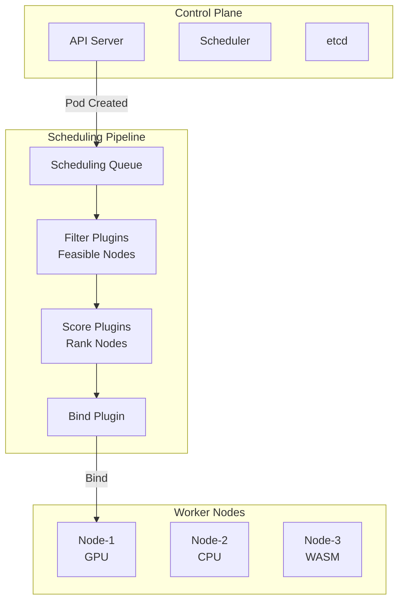
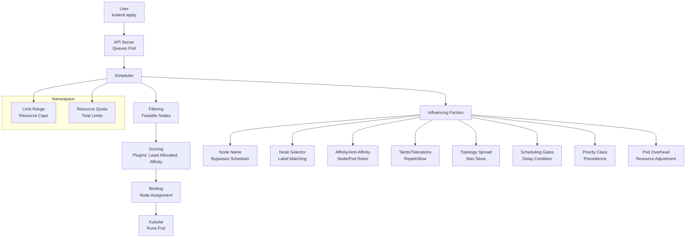

# Kubernetes Scheduler — Complete Deep-Dive Guide  
*(Every concept, diagram, YAML, and transcript line from the course video is folded into this file)*

---

> **Tutor’s words (exact)**  
> “Scheduler is trying to find the **most feasible node** to run the workload.  
> It **filters**, **scores**, then **binds** the Pod to the highest-rated node.”

---

## 0. 40-Second Recap from Video *(3:02 – 3:35)*
| Time-stamp | Tutor Quote |
|------------|-------------|
| 3:02:40 | “That was it about Pods … now we move to **Kubernetes Scheduling**.” |
| 3:03:12 | “Scheduler picks the node … but **how** it works is important.” |
| 3:03:36 | “Three nodes — WASM, GPU, CPU — **without labels** you may be unlucky.” |
| 3:04:04 | “**Labels & Selectors** are like putting stickers on books and picking them.” |
| 3:05:25 | “Namespaces provide **logical grouping & isolation** for teams.” |
| 3:11:29 | “Scheduler **filters → scores → binds**; we’ll alter it via nodeName, nodeSelector, affinity, taints/tolerations, topology constraints.” |
| 3:35:53 | “With this we’ve completed the **basic constructs** before deploying apps.” |

---

## 1. High-Level Architecture

### 2. Memory Diagram (how data flows in scheduler)


### 3. Real-World Complex Scheduling Scenarios
### 3.1 GPU ML Job with Anti-Affinity & Topology Spread

```
apiVersion: v1
kind: Pod
metadata:
  name: ml-gpu-job
  labels: { app: ml-gpu }
spec:
  schedulerName: default-scheduler
  topologySpreadConstraints:
  - maxSkew: 1
    topologyKey: "topology.kubernetes.io/zone"
    whenUnsatisfiable: DoNotSchedule
    labelSelector:
      matchLabels: { app: ml-gpu }
  affinity:
    nodeAffinity:
      requiredDuringSchedulingIgnoredDuringExecution:
        nodeSelectorTerms:
        - matchExpressions:
          - {key: "gpu-type", operator: In, values: ["nvidia-tesla-v100"]}
    podAntiAffinity:
      preferredDuringSchedulingIgnoredDuringExecution:
      - weight: 100
        podAffinityTerm:
          labelSelector:
            matchLabels: { app: ml-gpu }
          topologyKey: "kubernetes.io/hostname"
  containers:
  - name: trainer
    image: tensorflow/tensorflow:2.13-gpu
    resources:
      requests: { nvidia.com/gpu: 2, memory: "16Gi", cpu: "4" }
      limits:   { nvidia.com/gpu: 2, memory: "16Gi", cpu: "8" }
  tolerations:
  - key: "nvidia.com/gpu"
    operator: Exists
    effect: NoSchedule
```

### 3.2 High-Priority Web-Service with PriorityClass

```
apiVersion: scheduling.k8s.io/v1
kind: PriorityClass
metadata:
  name: prod-critical
value: 1000
globalDefault: false
description: "Only prod critical pods"
---
apiVersion: v1
kind: Pod
metadata:
  name: web-frontend
spec:
  priorityClassName: prod-critical
  containers:
  - image: nginx
    name: web
    resources: { requests: { cpu: "100m", memory: "128Mi" } }
```

### 4. Advanced Concepts
| Concept                    | Tutor Description                                     | YAML Snippet                                                                          |
| -------------------------- | ----------------------------------------------------- | ------------------------------------------------------------------------------------- |
| **Scheduling Gates**       | “Delay scheduling until external controller un-gates” | `schedulingGates: [{name: "controller-x"}]`                                           |
| **Taints & Tolerations**   | “Node repels pods; only pods with toleration land”    | `tolerations: [{key: "special", operator: Equal, value: "true", effect: NoSchedule}]` |
| **Topology Spread**        | “Evenly spread pods across zones/racks”               | See 3.1                                                                               |
| **Pod Overhead**           | “Add runtime overhead to scheduler math”              | `overhead: {cpu: "250m", memory: "100Mi"}` inside RuntimeClass                        |
| **Resource Quotas per NS** | “Hard limits for team namespaces”                     | `spec: hard: {cpu: "500m", memory: "200Gi", pods: "10"}`                              |


### 5. Visual Scheduler Flow (Filter → Score → Bind)
```

```

### 6. Example “Jason” (JSON) Architecture (for tooling)

```
{
  "scheduler": {
    "profiles": [
      {
        "schedulerName": "default-scheduler",
        "plugins": {
          "filter": ["NodeResourcesFit", "NodeAffinity", "TaintToleration"],
          "score": ["NodeResourcesBalancedAllocation", "ImageLocality"]
        }
      }
    ]
  }
}
```
### 7. Commands Cheat-Sheet (from tutor)

```
# Watch scheduler decisions
kubectl get events --field-selector reason=Scheduled

# Label nodes
kubectl label node node-01 workload=gpu gpu-type=nvidia-tesla-v100

# Add taint
kubectl taint node node-02 special=true:NoSchedule

# Remove taint
kubectl taint node node-02 special=true:NoSchedule-

# Show labels
kubectl get nodes --show-labels

# Scale & watch spread
kubectl scale deploy/app --replicas=9
kubectl get pods -o wide --sort-by='.spec.nodeName'
```

### 8. Troubleshooting Scheduler
| Symptom                 | Debug Steps                                                                     |
| ----------------------- | ------------------------------------------------------------------------------- |
| Pod **Pending**         | `kubectl describe pod <name>` → look at Events → check taints, affinity, quotas |
| **Scheduling gated**    | `kubectl get pod <name> -o jsonpath='{.spec.schedulingGates}'`                  |
| **Node not selectable** | verify labels & taints: `kubectl get node <name> --show-labels`                 |


### 9. Summary Slide (tutor closing 3:35:53)
```
“We learned labels & selectors, namespaces, resource quotas, limit ranges, how the scheduler queues/filters/scores, and how to influence it via nodeName, nodeSelector, affinity/anti-affinity, taints/tolerations, topology spread, scheduling gates, priority classes and pod overhead.”
```

# Kubernetes Scheduling Detailed Guide with Demo

This guide explains **Kubernetes Scheduling**, a critical process for placing pods on nodes, based on my tutor’s lecture from a YouTube video (https://www.youtube.com/watch?v=EV47Oxwet6Y&t=9360s, starting at 3:02:40 to 3:35:53). It covers the scheduler’s filtering and scoring mechanisms, labels/selectors, namespaces, node selectors, affinity/anti-affinity, taints/tolerations, topology constraints, priority classes, pod overhead, and scheduling gates. My tutor demonstrated commands like `kubectl label`, `kubectl taint`, and `kubectl apply` with YAML, so I’ll include his examples and real-world complex scenarios to help me recall for interviews.

## Table of Contents
- [Overview](#overview)
- [What the Scheduler Does](#what-the-scheduler-does)
- [Key Components of Scheduling](#key-components-of-scheduling)
- [Scheduling Flow Step-by-Step](#scheduling-flow-step-by-step)
- [Mermaid Diagram](#mermaid-diagram)
- [Real-World Examples with Complex Scenarios](#real-world-examples-with-complex-scenarios)
- [Sample JSON Configuration](#sample-json-configuration)
- [Additional Notes](#additional-notes)
- [References](#references)

## Overview
My tutor explained that the Kubernetes scheduler assigns pods to nodes after creation, using filtering (feasible nodes) and scoring (best fit) mechanisms. He highlighted the importance of labels/selectors for targeting nodes, namespaces for multi-tenancy, and advanced features like taints, topology spread, and priority classes. The demo spanned 3:02:40 to 3:35:53, showcasing practical configurations on a cluster (e.g., kubernetes133-a with three nodes).

## What the Scheduler Does
- **Node Assignment**: Matches pods to nodes based on resource availability and constraints.
- **Filtering**: Identifies feasible nodes meeting pod requirements.
- **Scoring**: Ranks nodes to select the optimal one.
- **Customization**: Supports node selectors, affinity, taints, topology spread, and priority-based decisions.
- **Advanced Features**: Handles scheduling gates, pod overhead, and multi-zone fault tolerance.

## Key Components of Scheduling
- **Scheduler**: Core component queuing pods, filtering, scoring, and binding to nodes.
- **API Server**: Updates pod/node status post-scheduling.
- **Kubelet**: Executes pod startup on assigned nodes.
- **Labels/Selectors**: Key-value pairs for targeting (e.g., `workload: web`).
- **Namespaces**: Logical grouping for resource isolation.
- **Taints/Tolerations**: Node-level repulsion and pod-level allowances.
- **Priority Classes**: Defines pod precedence (e.g., system-critical).

## Scheduling Flow Step-by-Step
My tutor walked through the scheduling process with demos. Here’s the detailed flow:

1. **Pod Creation**:
   - `kubectl apply -f pod.yaml` queues a pod for scheduling.
   - My tutor noted the scheduler picks up the pod next.

2. **Filtering Feasible Nodes**:
   - Checks node resources (CPU, memory) and constraints (e.g., node selector `workload: web`).
   - He demonstrated a pending pod due to missing labels.

3. **Scoring Nodes**:
   - Uses plugins (e.g., least allocated, node affinity) to score feasible nodes.
   - Highest-scored node is selected; he mentioned GitHub’s scheduler framework plugins.

4. **Binding to Node**:
   - Scheduler updates the API server with the node assignment.
   - My tutor showed `kubectl get pods -o wide` to verify node placement.

5. **Influencing Scheduling**:
   - **Node Name**: `nodeName: node-1` bypasses scheduler (e.g., `node-name.yaml`).
   - **Node Selector**: `nodeSelector: workload: web` targets labeled nodes (e.g., `node-selector.yaml`).
   - **Affinity/Anti-Affinity**: `requiredDuringScheduling` or `preferredDuringScheduling` (e.g., `node-affinity.yaml`).
   - **Taints/Tolerations**: `kubectl taint node node-3 app=demo:NoSchedule` repels pods without toleration (e.g., `toleration.yaml`).
   - **Topology Spread**: `maxSkew: 1` ensures even distribution (e.g., `topology.yaml`).
   - **Scheduling Gates**: Delays scheduling until a condition is met (e.g., `pod-scheduling-readiness.yaml`).
   - **Priority Class**: `priorityClassName: high-priority` sets precedence.
   - **Pod Overhead**: Adds runtime resource overhead (e.g., gVisor).

6. **Namespace Constraints**:
   - `kubectl apply -f limit-range.yaml` sets resource limits (e.g., max CPU 2, memory 2Gi).
   - `kubectl apply -f resource-quota.yaml` caps total resources (e.g., 500m CPU, 10 pods).
   - My tutor showed an oversized pod being rejected.

## Mermaid Diagram
This diagram reflects my tutor’s explanation of the scheduling process, including advanced features:



**Explanation**:
- **Scheduler** processes pods through filtering and scoring.
- **Influencing Factors** (node name, selectors, etc.) customize placement.
- **Namespace** constraints (limits, quotas) refine resource allocation.
- My tutor’s demos (e.g., taint rejection, topology spread) are reflected.

## Real-World Examples with Complex Scenarios
My tutor’s demos inspire these complex, real-world scenarios:

- **Scenario 1: Multi-Zone E-Commerce Application**:
  - **Setup**: 3 zones (us-east, us-west, eu-central) with 3 nodes each, labeled `topology.kubernetes.io/zone: us-east-1a`.
  - **Pod**: `ecommerce-pod.yaml` with 5 replicas, topology spread `maxSkew: 1`, and `priorityClassName: high-priority`.
  - **Flow**:
    1. `kubectl apply -f ecommerce-pod.yaml`: Scheduler distributes pods across zones (e.g., 2 in us-east, 2 in us-west, 1 in eu-central).
    2. `kubectl cordon node-us-east-1a`: One pod moves to another zone due to `maxSkew: 1`.
    3. `kubectl describe pod`: Shows balanced distribution and priority enforcement during node pressure.
  - **Complexity**: Fault tolerance, zone-aware scheduling, and priority handling.

- **Scenario 2: GPU-Intensive AI Workload with Taints**:
  - **Setup**: 4 nodes (2 CPU, 2 GPU), GPU nodes tainted with `kubectl taint node gpu-1 gpu=true:NoSchedule`.
  - **Pod**: `ai-pod.yaml` with `tolerations: [{key: "gpu", operator: "Equal", value: "true", effect: "NoSchedule"}]`, `nodeSelector: gpu-type: nvidia`, and `resources: requests: {nvidia.com/gpu: 1}`.
  - **Flow**:
    1. `kubectl apply -f ai-pod.yaml`: Pod schedules only on GPU nodes.
    2. `kubectl taint node gpu-1 gpu=true:NoExecute`: Non-tolerant pods evict; tolerant pod remains.
    3. `kubectl get pods -o wide`: Verifies GPU node assignment.
  - **Complexity**: Dedicated hardware, taint-based eviction, and resource-specific scheduling.

- **Scenario 3: Multi-Tenant SaaS Platform with Scheduling Gates**:
  - **Setup**: 3 namespaces (dev, test, prod), each with resource quotas (e.g., 1Gi memory, 2 pods).
  - **Pod**: `saas-pod.yaml` with `schedulingGates: [{name: "custom-approval"}]`, requiring a custom controller approval.
  - **Flow**:
    1. `kubectl apply -f saas-pod.yaml`: Pod enters `SchedulingGated` state.
    2. Custom controller patches pod to remove gate: `kubectl patch pod saas-pod --type=json -p='[{"op": "remove", "path": "/spec/schedulingGates"}]`.
    3. `kubectl get pods`: Pod schedules in prod namespace, respecting quota.
  - **Complexity**: Multi-tenancy, external approval, and quota enforcement.

## Sample JSON Configuration
This JSON represents a pod with advanced scheduling configurations:

```json
{
  "apiVersion": "v1",
  "kind": "Pod",
  "metadata": {
    "name": "advanced-pod",
    "namespace": "prod",
    "labels": {
      "app": "web",
      "env": "production"
    }
  },
  "spec": {
    "containers": [
      {
        "name": "web",
        "image": "nginx",
        "resources": {
          "requests": {"cpu": "500m", "memory": "512Mi"},
          "limits": {"cpu": "1", "memory": "1Gi"}
        }
      }
    ],
    "nodeSelector": {
      "workload": "web"
    },
    "affinity": {
      "nodeAffinity": {
        "requiredDuringSchedulingIgnoredDuringExecution": {
          "nodeSelectorTerms": [
            {
              "matchExpressions": [
                {"key": "topology.kubernetes.io/zone", "operator": "In", "values": ["us-east-1a", "us-west-1a"]}
              ]
            }
          ]
        },
        "preferredDuringSchedulingIgnoredDuringExecution": [
          {"weight": 100, "preference": {"matchExpressions": [{"key": "disk-type", "operator": "In", "values": ["ssd"]}]}}
        ]
      }
    },
    "tolerations": [
      {"key": "dedicated", "operator": "Equal", "value": "web", "effect": "NoSchedule"}
    ],
    "topologySpreadConstraints": [
      {
        "maxSkew": 1,
        "topologyKey": "topology.kubernetes.io/zone",
        "whenUnsatisfiable": "DoNotSchedule",
        "labelSelector": {"matchLabels": {"app": "web"}}
      }
    ],
    "priorityClassName": "high-priority",
    "schedulingGates": [{"name": "custom-approval"}],
    "overhead": {
      "pod": {"cpu": "100m", "memory": "128Mi"}
    }
  }
}
```

**Explanation**:
- **NodeSelector**: Targets web workload nodes.
- **Affinity**: Requires us-east-1a/us-west-1a, prefers SSD.
- **Tolerations**: Allows scheduling on dedicated web nodes.
- **TopologySpread**: Ensures zone balance.
- **PriorityClass**: High precedence.
- **SchedulingGates**: Delays until approved.
- **Overhead**: Accounts for runtime resources.

## Additional Notes
- **Labels/Selectors**: My tutor emphasized labeling nodes (e.g., `kubectl label node node-1 workload=web`) for targeting.
- **Namespaces**: Default (user pods), kube-system (critical components), kube-public (public access).
- **Debugging**: Use `kubectl describe pod` and `kubectl get nodes --show-labels`.
- **Kubernetes 1.33**: Introduces sidecar support, reduced crash loop delays, and enhanced scheduler plugins.
- **Time Context**: As of 11:45 AM IST, July 20, 2025, Kubernetes 1.33.0 is current.

## References
- [Kubernetes Scheduling](https://kubernetes.io/docs/concepts/scheduling-eviction/)
- [Node Affinity and Taints](https://kubernetes.io/docs/concepts/scheduling-eviction/assign-pod-node/)
- [Topology Spread Constraints](https://kubernetes.io/docs/concepts/scheduling-eviction/topology-spread-constraints/)
