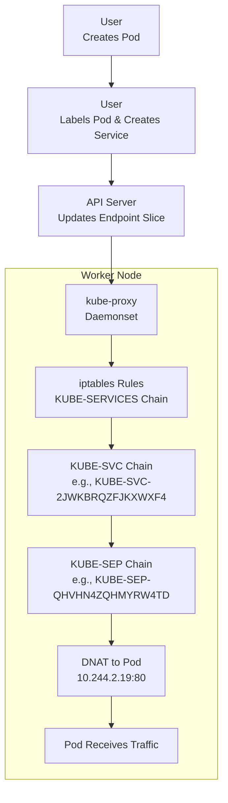

# Kubernetes kube-proxy Detailed Guide with Demo

This guide explains kube-proxy in Kubernetes, based on my tutor’s lecture and the practical demo he conducted. It covers how kube-proxy enables pod communication via services, manages ephemeral pod IPs, and configures iptables, IPVS, or NFTables rules. My tutor emphasized kube-proxy’s role on worker nodes and demonstrated it with iptables and service creation, so I’ll include his step-by-step breakdown and examples to help me recall for interviews.

## Table of Contents

- [Overview](#overview)
- [What kube-proxy Does](#what-kube-proxy-does)
- [Key Components of kube-proxy](#key-components-of-kube-proxy)
- [kube-proxy Flow Step-by-Step](#kube-proxy-flow-step-by-step)
- [Mermaid Diagram](#mermaid-diagram)
- [Real-Time Example with Demo](#real-time-example-with-demo)
- [Additional Notes](#additional-notes)
- [References](#references)

## Overview

My tutor said kube-proxy runs on worker nodes and handles communication to pods, which are ephemeral (new IP on restart). Since pods can’t be directly addressed, services provide stable access, and kube-proxy updates iptables, IPVS, or NFTables rules based on endpoint slices from the API server. He showed a demo on a self-managed cluster (`kubernetes133-a`, `kubernetes133-b`) with Flannel, using `iptables -t nat -L` to trace traffic.

## What kube-proxy Does

- **Manages Ephemeral Pods**: Routes traffic to pods despite IP changes.
- **Configures Rules**: Uses iptables, IPVS, or NFTables based on the proxy mode.
- **Enables Services**: Maps service IPs to pod IPs via DNAT (Destination Network Address Translation).
- **Supports Load Balancing**: IPVS offers advanced algorithms (e.g., round-robin, weighted hashing).
- **Integration**: Works with CoreDNS for service discovery (to be detailed later).

## Key Components of kube-proxy

- **kube-proxy Pod**: Runs as a daemonset on each worker node (e.g., on `kubernetes133-b`).
- **API Server**: Provides endpoint slices mapping services to pod IPs.
- **iptables**: Packet filtering framework with chains (e.g., `KUBE-SERVICES`, `KUBE-SVC`).
- **IPVS**: Layer 4 load balancer built into the kernel, with multiple algorithms.
- **NFTables**: Modern replacement for iptables with better performance.
- **Endpoint Slice**: Links service IPs (e.g., `10.97.176.245`) to pod IPs (e.g., `10.244.2.19`).
- **Service**: Stable entry point (e.g., `shared-service`) with a cluster IP.

## kube-proxy Flow Step-by-Step

### User Creates Pod

- **Pod Creation**: I have the shared-namespace pod (busybox and nginx) running on `kubernetes133-b` with IP `10.244.2.19`.
- **Ephemeral Nature**: My tutor noted pods are ephemeral, needing a service.

### User Labels Pod and Creates Service

- **Label Pod**: I label the pod: `kubectl label pod shared-namespace app=shared`.
- **Create Service**: I apply `svc.yaml`: `kubectl apply -f svc.yaml`, creating `shared-service` with cluster IP `10.97.176.245`.
- **Trigger Endpoint Slice**: He said this triggers endpoint slice creation.

### API Server Updates Endpoint Slice

- **Endpoint Mapping**: The API server maps `shared-service` to `10.244.2.19` (nginx pod).
- **Verify Endpoint Slice**: My tutor showed this with `kubectl get endpointslice`.

### kube-proxy Configures Rules

- **Fetch Endpoint Slice**: kube-proxy, running as a daemonset, fetches the endpoint slice and configures iptables rules.
- **Demonstrate iptables**: He demonstrated `sudo iptables -t nat -L KUBE-SERVICES` showing the `KUBE-SVC-2JWKBRQZFJKXWXF4` chain for `10.97.176.245`.

### iptables Chains Process Traffic

- **Traffic Routing**: Traffic to `10.97.176.245:80` hits the `KUBE-SERVICES` chain, routed to `KUBE-SVC-2JWKBRQZFJKXWXF4`.
- **Chain Processing**: This chain marks traffic (`KUBE-MARK-MASQ`) and forwards to `KUBE-SEP-QHVHN4ZQHMYRW4TD`.
- **Trace Chain**: My tutor traced `sudo iptables -t nat -L KUBE-SVC-2JWKBRQZFJKXWXF4` showing DNAT to `10.244.2.19:80`.

### Traffic Reaches Pod

- **DNAT Rule**: The DNAT rule redirects traffic to the nginx pod, accessible via [http://10.97.176.245](http://10.97.176.245).
- **Confirm Access**: He confirmed this with `kubectl exec` and `wget`.

### Cleanup (Optional)

- **Resource Deletion**: When the service or pod deletes, kube-proxy removes the iptables rules.
- **Implication**: My tutor implied this in the flow.

## Mermaid Diagram

This diagram follows my tutor’s demo flow:



### Explanation

*   **User Initiation**: User initiates with pod and service creation.
    
*   **API Server Update**: API Server updates endpoint slices.
    
*   **kube-proxy Configuration**: kube-proxy configures iptables chains to route traffic to the pod.
    
*   **My Tutor’s Chaining System**: (KUBE-SERVICES → KUBE-SVC → KUBE-SEP) is reflected.
    

Real-Time Example with Demo
---------------------------

My tutor’s demo inspires this: Expose a web app (web-app) with kube-proxy.

### Setup

*   **Cluster**: Kubernetes 1.33.0 cluster (kubernetes133-a, kubernetes133-b) with Flannel.
    

Pod

Create web-pod.yaml:

```
apiVersion: v1
kind: Pod
metadata:
  name: web-app
spec:
  containers:
  - name: web
    image: nginx

```

Service

Create svc-web.yaml:

```
apiVersion: v1
kind: Service
metadata:
  name: web-service
spec:
  selector:
    app: web
  ports:
  - protocol: TCP
    port: 80
    targetPort: 80

```

Label pod:

```
kubectl label pod web-app app=web
```

Apply:

```
kubectl apply -f svc-web.yaml
```

Flow

1.  **Pod Running**: Pod runs on kubernetes133-b with IP 10.244.2.20 (check kubectl get pods -o wide).
    
2.  **Label and Service Creation**: I label the pod and create the service; API server updates the endpoint slice.
    
3.  **kube-proxy Configuration**: kube-proxy on kubernetes133-b configures iptables: sudo iptables -t nat -L KUBE-SERVICES shows a new chain (e.g., KUBE-SVC-XYZ).
    
4.  **Service IP Verification**: I grep for the service IP (e.g., 10.97.177.100): sudo iptables -t nat -L KUBE-SERVICES -n --line-numbers | grep 10.97.177.100 shows the chain.
    
5.  **Chain Verification**: Inside the chain (e.g., KUBE-SVC-XYZ): sudo iptables -t nat -L KUBE-SVC-XYZ -n --line-numbers shows DNAT to 10.244.2.20:80.
    
6.  **Traffic Testing**: I test: curl 10.97.177.100 returns the nginx page.
    
7.  **Resource Deletion**: Delete: kubectl delete -f svc-web.yaml; kube-proxy removes rules.
    

### Complexity

*   **Service Exposure**: iptables tracing and demo-style verification, matching my tutor’s approach.
    

Additional Notes
----------------

*   **Proxy Modes**: My tutor listed iptables (default, mature), NFTables (modern, simpler), and IPVS (advanced, kernel-based).
    
*   **Debugging**: Use sudo iptables -t nat -L and kubectl get endpointslice as he demoed.
    
*   **Load Balancing**: IPVS supports round-robin and weighted hashing for high traffic.
    
*   **Time Context**: As of 05:50 PM IST, July 05, 2025, Kubernetes 1.33.0 supports NFTables and IPVS easily.
    

References

*   [Kubernetes kube-proxy](https://kubernetes.io/docs/concepts/overview/components/#kube-proxy)
    
*   [iptables Documentation](https://www.netfilter.org/documentation/index.html)
    
*   [IPVS Admin Guide](https://www.kernel.org/doc/Documentation/networking/ipvs.txt)
