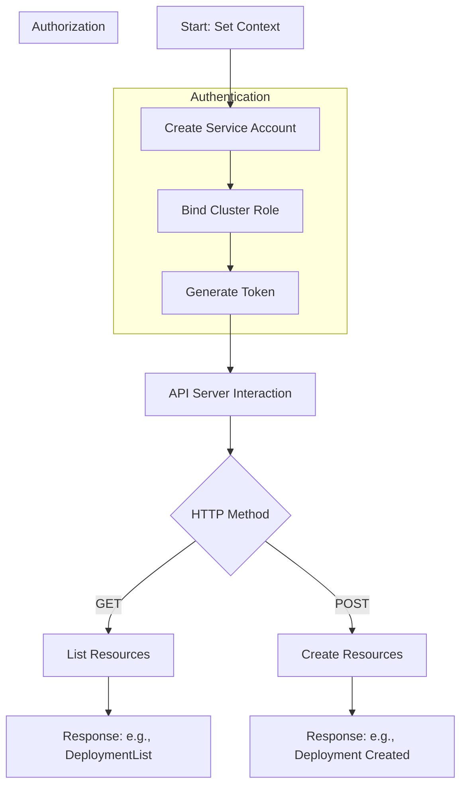

# Kubernetes User Authentication, Authorization, and API Interaction Guide

This guide explains how to create users, generate tokens, set up authentication and authorization in Kubernetes, and interact with the API server. It uses real-world examples, including a complex scenario with a deployment for a weather application, to make the process clear and practical.

## Table of Contents

- [Overview](#overview)
- [Key Concepts](#key-concepts)
  - [Authentication](#authentication)
  - [Authorization](#authorization)
  - [API Server Interaction](#api-server-interaction)
- [Step-by-Step Process](#step-by-step-process)
  - [1. Setting Up the Context](#1-setting-up-the-context)
  - [2. Creating a Service Account](#2-creating-a-service-account)
  - [3. Binding Roles](#3-binding-roles)
  - [4. Generating a Token](#4-generating-a-token)
  - [5. Interacting with the API Server](#5-interacting-with-the-api-server)
- [Mermaid Diagram](#mermaid-diagram)
- [Real-World Complex Example](#real-world-complex-example)
- [Troubleshooting Tips](#troubleshooting-tips)
- [References](#references)

## Overview

Kubernetes uses authentication and authorization to control who can access the cluster and what they can do. Service accounts and tokens are used to let users or applications talk to the API server securely. This guide walks you through creating a user, setting up OpenSSL certificates (if needed), generating tokens, and using API calls like GET and POST to manage resources like deployments and pods.

## Key Concepts

### Authentication

- **What it is**: Verifies who you are (e.g., a user or service account).
- **How it works**: Uses tokens, certificates, or usernames/passwords.
- **Example**: A service account named `sam` proves its identity with a token.

### Authorization

- **What it is**: Decides what you can do after being authenticated.
- **How it works**: Uses roles and role bindings to grant permissions.
- **Example**: The `cluster-admin` role gives full control to `sam`.

### API Server Interaction

- **What it is**: The API server is the brain of Kubernetes, handling all requests.
- **How it works**: You send HTTP requests (GET, POST) with a token to manage objects like pods or deployments.
- **Example**: A GET request lists deployments; a POST creates a new one.

## Step-by-Step Process

### 1. Setting Up the Context

- **Why**: Ensures you’re working with the right cluster.
- **How**: Use `kubectl config use-context` to switch contexts.
- **Command**: `kubectl config use-context kubernetes-admin@kubernetes`
- **Result**: Switches to the `kubernetes-admin@kubernetes` context, ready to manage the cluster.

### 2. Creating a Service Account

- **Why**: A service account acts as a user for applications or scripts.
- **How**: Use `kubectl create serviceaccount` to make one.
- **Command**: `kubectl create serviceaccount sam --namespace default`
- **Result**: Creates a service account named `sam` in the default namespace.

### 3. Binding Roles

- **Why**: Grants permissions to the service account.
- **How**: Use `kubectl create clusterrolebinding` to link a role.
- **Command**: `kubectl create clusterrolebinding sam-clusteradmin-binding --clusterrole=cluster-admin --serviceaccount=default:sam`
- **Result**: Binds the `cluster-admin` role (full access) to `sam`, allowing it to do anything in the cluster.

### 4. Generating a Token

- **Why**: Tokens are used to authenticate API requests.
- **How**: Use `kubectl create token` to get a token for the service account.
- **Command**: `kubectl create token sam`
- **Result**: Outputs a token (e.g., `token-data`), which you can use in API calls.
- **Note**: For OpenSSL certificates (optional for human users), generate a key pair with `openssl req -new -newkey rsa:2048 -nodes -keyout sam.key -out sam.csr` and get it signed by the cluster’s CA, but tokens are simpler for service accounts.

### 5. Interacting with the API Server

- **Why**: Manage Kubernetes resources directly.
- **How**: Use `curl` with HTTP methods (GET, POST) and the token.
- **Examples**:
  - **List Deployments**:
    ```bash
    curl -X GET SAPISERVER/apis/apps/v1/namespaces/default/deployments -H "Authorization: Bearer $TOKEN" -k
    ```
    **Result**: Returns a DeploymentList (e.g., `items: []` if none exist).
  - **List Pods**:
    ```bash
    curl -X GET SAPISERVER/api/v1/namespaces/default/pods -H "Authorization: Bearer $TOKEN" -k
    ```
    **Result**: Returns a PodList (e.g., `items: []` if no pods).
  - **Create Deployment**:
    ```bash
    curl -X POST SAPISERVER/apis/apps/v1/namespaces/default/deployments -H "Authorization: Bearer $TOKEN" -H 'Content-Type: application/json' -d @deploy.json -k
    ```
    **Result**: Creates a deployment (e.g., `nginx` with UID `d59c96c1-2cb0-4a1f-8856-c0fdf95d6656`).

**Note**: Replace `SAPISERVER` with your API server URL (e.g., `https://kubernetes-api:6443`). The `-k` flag skips SSL verification (use cautiously).

## Mermaid Diagram

This diagram shows the flow from user creation to API interaction:


### Explanation

*   Start by setting the context.
    
*   Create and authorize a service account, then generate a token.
    
*   Use the token to send GET or POST requests to the API server.
    

Real-World Complex Example
--------------------------

Imagine you’re managing a weather application (brezyweather) across multiple environments (e.g., staging, production). You need a service account to automate deployment and monitoring.

### Scenario

**Goal**: Deploy brezyweather with 3 replicas in the staging namespace, list pods, and monitor via API.

### Steps:

1.  kubectl config use-context kubernetes-admin@kubernetes
    
2.  kubectl create serviceaccount brezyweather-sa --namespace staging
    
3.  kubectl create clusterrolebinding brezyweather-admin-binding --clusterrole=cluster-admin --serviceaccount=staging:brezyweather-sa
    
4.  kubectl create token brezyweather-sa (e.g., token-xyz123)
    
5.  ``` { "apiVersion": "apps/v1", "kind": "Deployment", "metadata": { "name": "brezyweather", "namespace": "staging" }, "spec": { "replicas": 3, "selector": { "matchLabels": { "app": "brezyweather" } }, "template": { "metadata": { "labels": { "app": "brezyweather" } }, "spec": { "serviceAccountName": "brezyweather-sa", "containers": \[{ "name": "brezyweather", "image": "codewithpraveen/labs-k8s-brezyweather:1.0" }\] } } }}Apply:**bash**Copycurl -X POST https://kubernetes-api:6443/apis/apps/v1/namespaces/staging/deployments -H "Authorization: Bearer token-xyz123" -H 'Content-Type: application/json' -d @brezyweather-deploy.json -k ```
    
6.  curl -X GET https://kubernetes-api:6443/api/v1/namespaces/staging/pods -H "Authorization: Bearer token-xyz123" -k**Result**: Shows 3 pods if successful.
    
7.  **Monitor**: Use a script to periodically check pod status.
    

### Complexity

*   Handles
