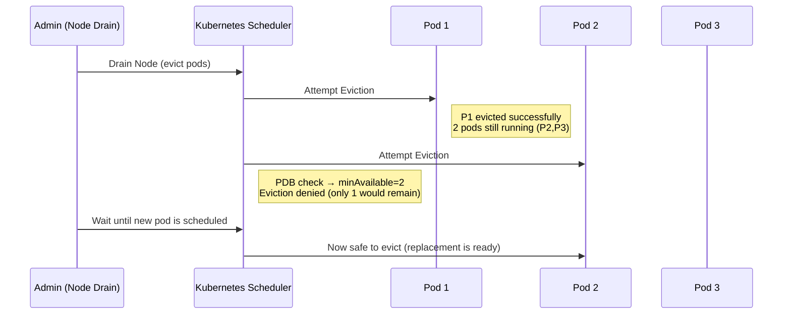

# 📘 Kubernetes Pod Disruption Budgets (PDBs)

## 🔐 What is a Pod Disruption Budget?
A **Pod Disruption Budget (PDB)** is a Kubernetes policy that defines how many pods of an application must remain available during **voluntary disruptions**, such as:
- Node drain (maintenance, OS patching)
- Cluster upgrades
- Manual pod deletion

⚠️ **Note**: PDBs do **not** prevent involuntary disruptions (like node crashes, OOM kills).

---

## 🏢 Real-World Scenario

Imagine a production service:

- **Deployment**: `payment-service`  
- **Replicas**: 3  
- **SLA**: At least 2 replicas must always be available  

### Without a PDB:
If an admin drains a node, Kubernetes may evict 2 pods at once → leaving only 1 pod to handle traffic → risk of overload or downtime.  

### With a PDB (`minAvailable: 2`):
Kubernetes ensures at least 2 pods remain available.  
It only allows evicting 1 pod at a time until a replacement is ready.

---

## ✅ Example PDB Manifest

```yaml
apiVersion: policy/v1
kind: PodDisruptionBudget
metadata:
  name: payment-service-pdb
  namespace: production
spec:
  minAvailable: 2
  selector:
    matchLabels:
      app: payment-service
```


## ⚖️ Alternative: Using maxUnavailable

### Instead of minAvailable, you can define how many pods can be unavailable during a disruption.
```
apiVersion: policy/v1
kind: PodDisruptionBudget
metadata:
  name: payment-service-pdb
  namespace: production
spec:
  maxUnavailable: 1
  selector:
    matchLabels:
      app: payment-service
```

```
PDBs ensure high availability during planned disruptions.

They prevent too many replicas going down at once.

Use either:

minAvailable → minimum number of pods that must stay running.

maxUnavailable → maximum number of pods allowed to be unavailable.

Essential for production workloads with strict SLAs.
```