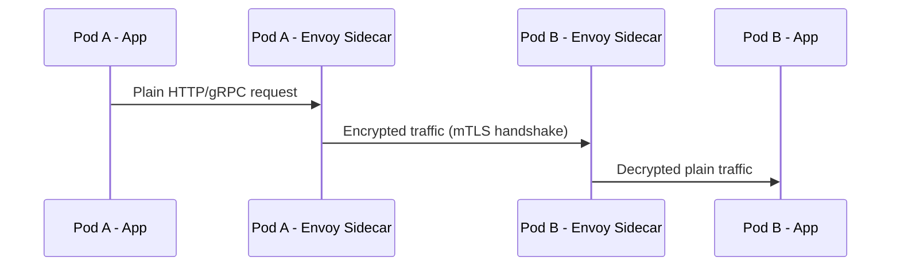

# Istio Mutual TLS (mTLS) with Envoy Sidecars in Kubernetes

## 🔐 Overview
Istio secures pod-to-pod communication using **mutual TLS (mTLS)**.  
This is achieved by automatically injecting an **Envoy sidecar proxy** into each pod.  
The sidecar proxies handle:
- Encryption/decryption
- Certificate management
- Identity verification
- Traffic routing

Your applications **do not need to implement TLS themselves** — Envoy + Istio handle it transparently.

---

## 🚀 How it Works

### 1. Sidecar Injection
- Istio uses a **Mutating Admission Controller** (`istio-sidecar-injector`) to inject an Envoy proxy container into your pods.
- Injection methods:
  - **Automatic** (recommended): Label the namespace  
    ```bash
    kubectl label namespace default istio-injection=enabled
    ```
  - **Manual**: Use  
    ```bash
    istioctl kube-inject
    ```

### 2. Pod-to-Pod Communication with mTLS
1. Application sends traffic to `localhost` (Envoy proxy).
2. Envoy encrypts traffic and initiates a **mutual TLS handshake**.
3. Both Envoys exchange Istio-issued X.509 certificates.
4. If valid, encrypted traffic flows between the two sidecars.
5. Destination Envoy decrypts traffic and forwards it to the app.

---

## 🔑 Certificate Management
- Certificates are issued by **Istiod** (Istio’s control plane) using the Istio CA.
- Each Envoy sidecar gets:
  - A unique **SPIFFE identity**
  - Short-lived X.509 certificates (rotated automatically ~24h)
- No manual cert management is required.

---

## 🌀 Pod & Sidecar Lifecycle

- A **sidecar is just another container in the pod**.
- **If Pod dies → sidecar dies** (both share the same lifecycle).
- **If Pod restarts → new sidecar is injected** with new certs.
- **If Envoy container crashes → kubelet restarts it** (like any other container).
- Envoy sidecars never live independently of their parent pod.

---

## ⚖️ With Istio vs Without Istio

| Scenario        | Behavior                                                                 |
|-----------------|--------------------------------------------------------------------------|
| **Without Istio** | App must handle TLS itself. Typically one-way TLS only (client → server). |
| **With Istio**    | Envoy sidecars handle **automatic mutual TLS** with identity validation. |

---

## 📄 Example: Enable Strict mTLS

```yaml
apiVersion: security.istio.io/v1beta1
kind: PeerAuthentication
metadata:
  name: default
  namespace: default
spec:
  mtls:
    mode: STRICT

```




```mermaid
flowchart TD
    A[Pod Created] --> B[Envoy Sidecar Injected]
    B --> C[App Container Started]
    C --> D[Envoy Sidecar Started]
    D --> E[Both Containers Running]

    E -->|If Pod Dies| F[Pod Terminated (App + Envoy Down)]
    F --> A          %% <-- this missing edge added

    E -->|If Pod Restarts| A
    E -->|If Envoy Crashes| G[Envoy Container Restarted by kubelet]
    G --> E
```