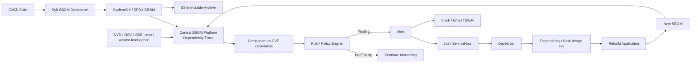
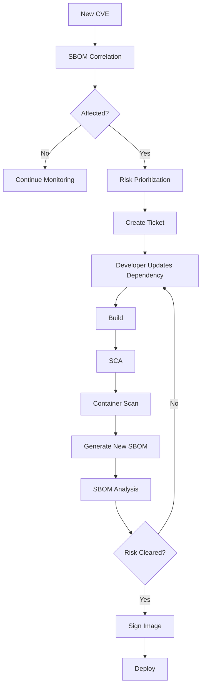

# Enterprise DevSecOps CI/CD Pipeline

## 1. Purpose

This document describes an enterprise-grade CI/CD pipeline for building, validating, securing, signing, publishing, and deploying containerized applications to Kubernetes/EKS.

The design separates **pre-build source security**, **build-time security**, **artifact security**, and **deployment/admission controls**.

---

## 2. Reference Architecture

```mermaid
flowchart LR
    Dev[Developer] --> Git[Git / GitHub]
    Git --> CI[CI Pipeline]

    CI --> Secret[Secret Scanning]
    Secret --> SAST[SAST]
    SAST --> SCA[SCA / Dependency Check]
    SCA --> Test[Unit Tests]
    Test --> Build[Maven / npm / pip Build]

    Build --> Image[Docker Image Build]
    Image --> ImageScan[Container Image Scan - Trivy]
    Image --> SBOM[SBOM Generation - Syft]

    ImageScan --> Gate{Security Gate}
    SBOM --> Gate

    Gate -->|PASS| Sign[Cosign Image Signing]
    Gate -->|FAIL| Stop[Stop Pipeline]

    Sign --> Registry[ECR / ACR / Artifact Registry]

    Registry --> DeployConfig[Update Helm / GitOps Repository]
    DeployConfig --> Argo[Argo CD]
    Argo --> Admission[Admission Policy]
    Admission --> EKS[EKS / Kubernetes]

    EKS --> Runtime[Runtime Security / Observability]
    Runtime --> Feedback[Security Findings / Alerts]
    Feedback --> Dev
```



---

## 3. Pipeline Stages

### Stage 1 — Checkout

```text
Git Repository
     |
     v
Checkout source
```

Controls:
- Protected branches
- Signed commits where required
- CODEOWNERS
- Pull-request review
- Branch protection

---

### Stage 2 — Secret Scanning

Purpose: prevent credentials from entering the build.

Typical tools:
- Gitleaks
- TruffleHog
- GitHub secret scanning

Example:

```bash
gitleaks detect --source . --redact
```

Failure condition:

```text
AWS_ACCESS_KEY
Private Key
Database Password
API Token
```

If a high-confidence secret is detected:

```text
FAIL PIPELINE
```

Important: rotating a leaked credential is still required; deleting it from the latest commit is not sufficient if it exists in Git history.

---

## 4. SAST

SAST analyzes source code without executing the application.

Examples:
- SonarQube
- Semgrep
- Checkmarx
- Fortify

Typical findings:

```text
SQL Injection
Command Injection
Hardcoded Credentials
Unsafe Deserialization
Insecure Cryptography
```

Enterprise pattern:

```text
PR -> SAST -> Quality/Security Gate -> Merge
```

---

## 5. SCA

SCA analyzes application dependencies.

Examples:
- OWASP Dependency-Check
- Snyk
- Mend
- Black Duck
- Sonatype

For Java:

```text
pom.xml
   |
   v
Dependency Tree
   |
   v
SCA
   |
   v
CVE / License Findings
```

Example:

```text
log4j-core 2.x
       |
       v
CVE
       |
       v
CRITICAL
       |
       v
Fixed version identified
```

SCA is primarily a **source/dependency-level control**.

---

## 6. Build

Example:

```bash
mvn clean package
```

Output:

```text
target/application.jar
```

The artifact should be versioned and traceable to:
- Git commit SHA
- Build ID
- Application version
- Pipeline execution
- Dependency versions

---

## 7. Container Image Build

Example:

```bash
docker build \
  --pull \
  -t payment-service:${GIT_SHA} .
```

Prefer:
- Minimal base images
- Pinned versions/digests
- Non-root execution
- Multi-stage builds
- No secrets in Dockerfile
- Read-only filesystem where possible
- Dropped Linux capabilities

---

## 8. Container Image Scanning

Example:

```bash
trivy image \
  --severity HIGH,CRITICAL \
  --exit-code 1 \
  payment-service:${GIT_SHA}
```

The image scanner can identify vulnerabilities in:

```text
Application packages
OS packages
Libraries
Runtime components
```

Example:

```text
Image
 |
 +-- Ubuntu packages
 +-- OpenSSL
 +-- glibc
 +-- Java runtime
 +-- Application JAR
```

A mature organization defines the gate explicitly, for example:

```text
CRITICAL with available fix -> FAIL
HIGH with available fix -> FAIL/REVIEW depending on policy
No fix available -> Risk acceptance / exception workflow
```

Do not blindly fail on every CVE.

---

# 9. SBOM Generation

Use Syft or Trivy.

Example with Syft:

```bash
syft payment-service:${GIT_SHA} \
  -o cyclonedx-json=sbom.json
```

Output:

```text
sbom.json
```

Common formats:
- CycloneDX JSON
- SPDX JSON
- SPDX tag-value

The SBOM represents the components contained in the final artifact.

Example:

```text
payment-service
 |
 +-- Spring Boot
 +-- Jackson
 +-- Log4j
 +-- Java
 +-- OpenSSL
 +-- OS packages
```

---

## 10. SBOM Storage

Recommended enterprise pattern:

```text
                    SBOM
                     |
          +----------+----------+
          |                     |
          v                     v
Central SBOM Platform          S3
(Dependency-Track etc.)       Archive
```

The centralized platform provides inventory, vulnerability correlation, dashboards, and APIs.

S3 is useful for:
- Long-term retention
- Audit evidence
- Backup
- Historical versions
- Immutable archival

---

## 11. Image Signing

Use Cosign/Sigstore.

Example:

```bash
cosign sign \
  --key env://COSIGN_PRIVATE_KEY \
  $IMAGE_DIGEST
```

Prefer signing by immutable **digest**, not only by mutable tag.

```text
payment-service@sha256:abc123...
                 |
                 v
               Cosign
                 |
                 v
              Signature
```

---

## 12. Push to Registry

Example:

```bash
docker push $IMAGE
```

Registry:

```text
ECR / ACR / GCP Artifact Registry
```

The registry is the trusted artifact distribution point.

---

## 13. GitOps Deployment

CI should generally avoid directly modifying the production cluster.

Instead:

```text
CI
 |
 v
GitOps Repository
 |
 | Update image digest
 v
Argo CD
 |
 v
Kubernetes
```

Example:

```yaml
image:
  repository: <registry>/payment-service
  digest: sha256:abc123...
```

Using a digest gives stronger supply-chain integrity than relying only on:

```yaml
tag: latest
```

---

## 14. Admission Control

Before Kubernetes accepts the workload:

```text
Argo CD
   |
   v
Admission Controller
   |
   +-- Is image signed?
   +-- Is image from trusted registry?
   +-- Is digest pinned?
   +-- Is namespace allowed?
   +-- Is securityContext compliant?
   +-- Is privileged mode prohibited?
```

Possible technologies:
- Kyverno
- OPA Gatekeeper
- Kubernetes Pod Security Standards

Example policy concept:

```text
IF image signature is invalid
THEN DENY deployment
```

---

## 15. Runtime Security

After deployment:

```text
Kubernetes
   |
   +-- CloudWatch
   +-- OpenTelemetry
   +-- Falco / runtime controls
   +-- Application logs
   +-- Security findings
```

Monitor:
- Unexpected processes
- Privilege escalation
- Network anomalies
- Container restarts
- Authentication failures
- Resource anomalies

---

## 16. Enterprise Security Gates

A useful model is:

```text
                 Security Gates

Secret Scan -------> Gate 1
SAST --------------> Gate 2
SCA ---------------> Gate 3
Unit Tests --------> Gate 4
Image Scan --------> Gate 5
SBOM --------------> Inventory / Risk
Signing -----------> Gate 6
Admission ----------> Gate 7
Runtime ------------> Continuous Control
```

---

## 17. Important Interview Distinction

Do not describe every scanner as doing the same job.

| Control | Main question |
|---|---|
| Secret Scan | Did someone commit credentials? |
| SAST | Is the source code insecure? |
| SCA | Are source dependencies vulnerable? |
| Image Scan | Is the built image vulnerable? |
| SBOM | What exactly is inside the artifact? |
| SBOM Analysis | Did a known component become vulnerable? |
| Image Signing | Was this artifact produced/trusted by us? |
| Admission Policy | Should Kubernetes accept this artifact/workload? |
| Runtime Security | Is the running workload behaving safely? |

---

## 18. Enterprise Failure Handling

Example:

```text
Critical CVE
    |
    v
Image Scan
    |
    v
Security Gate
    |
   FAIL
    |
    +--> Developer notification
    +--> Jira ticket
    +--> Security dashboard
    +--> Remediation SLA
```

If an exception is required:

```text
Finding
  |
  v
Risk assessment
  |
  +--> Compensating controls?
  +--> Exploitability?
  +--> Internet exposure?
  +--> Business criticality?
  |
  v
Time-bound exception
```

Never use permanent blanket exceptions.

---

## 19. Recommended Enterprise Controls

### Source
- Branch protection
- CODEOWNERS
- Secret scanning
- SAST
- SCA

### Build
- Reproducible builds where practical
- Trusted build runners
- Dependency pinning
- Minimal images

### Artifact
- Image scanning
- SBOM
- Signing
- Provenance/attestations
- Immutable registry controls

### Deployment
- GitOps
- Admission policies
- Signed-image verification
- Pod Security Standards
- Network Policies

### Runtime
- CloudWatch
- OpenTelemetry
- Runtime threat detection
- Central logging
- Incident response

---

## 20. Interview Summary

A strong enterprise answer:

> "I would implement security as a series of controls throughout the software supply chain rather than relying on a single scanner. Secret scanning and SAST protect the source, SCA protects application dependencies, container scanning validates the final image, Syft generates an SBOM for artifact transparency, and the SBOM is centrally analyzed for ongoing vulnerability exposure. After passing the security gates, the image is signed using Cosign and pushed to a trusted registry. Deployment is handled through GitOps, and Kubernetes admission policies verify the image signature and workload security requirements before deployment. Runtime telemetry and security monitoring then provide continuous protection."

---

# SBOM Vulnerability Analysis Pipeline

## 1. Purpose

This pipeline addresses a problem that build-time SCA alone cannot completely solve:

> **A software artifact can become vulnerable after it has already passed CI/CD.**

A new CVE can be published weeks or months after an image was built.

The SBOM gives the organization a machine-readable inventory of what was shipped.

---

## 2. Architecture



---

## 3. Why SBOM Analysis Exists

Consider:

```text
January

Application
   |
   v
SCA
   |
   v
PASS
   |
   v
Image
   |
   v
SBOM
   |
   v
Production
```

Then in March:

```text
NEW CVE DISCLOSED
        |
        v
Affected component
        |
        v
Existing production image
        |
        v
SBOM identifies the component
        |
        v
Affected application identified
```

The application did not need to change for the vulnerability to become relevant.

---

## 4. SCA vs SBOM Analysis

| Control | Purpose |
|---|---|
| SCA | Identify vulnerable dependencies during development/build |
| Image scanning | Identify vulnerabilities in the built image |
| SBOM | Record the exact software composition |
| SBOM analysis | Continuously correlate known vulnerabilities with shipped components |

There can be overlap.

The enterprise value of SBOM analysis is **continuous inventory and exposure analysis**, not simply running the same scanner again.

---

## 5. SBOM Generation

Example:

```bash
syft payment-service:1.8.0 \
  -o cyclonedx-json=sbom.json
```

Result:

```text
sbom.json
```

Example conceptual content:

```json
{
  "bomFormat": "CycloneDX",
  "components": [
    {
      "name": "log4j-core",
      "version": "2.17.1"
    },
    {
      "name": "openssl",
      "version": "3.x"
    }
  ]
}
```

The actual SBOM contains substantially more metadata such as package identifiers, versions, hashes, licenses, and relationships.

---

## 6. Upload to Central Platform

For Dependency-Track, the CI pipeline can publish the CycloneDX SBOM through its API.

Conceptually:

```text
CI
 |
 v
sbom.json
 |
 v
Dependency-Track API
 |
 v
Project: payment-service
Version: 1.8.0
```

Dependency-Track maintains the component inventory and performs vulnerability analysis.

---

## 7. S3 Archive

An enterprise can additionally archive:

```text
s3://security-sbom/
    payment-service/
       1.7.0/sbom.json
       1.8.0/sbom.json
       1.9.0/sbom.json
```

Recommended controls:
- S3 versioning
- SSE-KMS
- Restricted IAM
- Bucket policies
- Object Lock where regulatory retention requires it
- CloudTrail data events where appropriate

---

## 8. Vulnerability Intelligence

The analysis platform needs vulnerability intelligence.

Conceptually:

```text
                  Vulnerability Intelligence
                           |
          +----------------+----------------+
          |                |                |
          v                v                v
         NVD              OSV          Vendor Advisories
          |                |                |
          +----------------+----------------+
                           |
                           v
                  Vulnerability Platform
                           |
                           v
                         SBOM
```

Sources and availability vary by product and configuration.

---

## 9. Continuous Re-evaluation

Monday:

```text
payment-service:1.8
        |
        v
SBOM
        |
        v
No known critical CVE
```

Wednesday:

```text
New CVE
   |
   v
Vulnerability intelligence updated
   |
   v
Existing components re-evaluated
   |
   v
payment-service:1.8
   |
   v
CRITICAL finding
```

This is the major value of continuous SBOM analysis.

---

## 10. Risk Prioritization

Do not prioritize only by CVSS.

Consider:

```text
Risk =
  Severity
+ Exploitability
+ Internet Exposure
+ Asset Criticality
+ Environment
+ Runtime Reachability
+ Compensating Controls
```

Example:

```text
CVSS: 9.8
+
Internet-facing API
+
Production
+
Known exploitation
=
P0 / Immediate remediation
```

Whereas:

```text
CVSS: 9.8
+
Unused development library
+
Non-production
+
Not reachable
=
Lower operational priority
```

The exact scoring model should follow organizational policy.

---

## 11. Alerting

Example:

```text
Dependency-Track
      |
      v
Critical CVE
      |
      +----> Jira / ServiceNow
      |
      +----> Slack / Teams
      |
      +----> Email
      |
      +----> SIEM
      |
      +----> Security Dashboard
```

The ticket should contain:

```text
Application
Version
Environment
Component
Current Version
Vulnerable Version Range
Fixed Version
CVE
Severity
CVSS
Evidence
Remediation
SLA
Owner
```

---

## 12. Remediation Loop



---

## 13. Important: The SBOM Tool Does Not Normally Fix the Vulnerability

For example:

```text
SBOM Analysis
     |
     v
log4j 2.14.1
     |
     v
CVE detected
     |
     v
Fixed version = 2.17.1
```

The tool reports the remediation.

The developer changes:

```text
pom.xml
```

Then the application is rebuilt.

---

## 14. Enterprise Scheduling Model

You can have both:

### Real-time / event-driven

```text
New SBOM
   |
   v
Immediate analysis
```

### Continuous monitoring

```text
New vulnerability intelligence
   |
   v
Re-evaluate existing inventory
```

### Periodic reconciliation

```text
Daily / weekly
   |
   v
Verify inventory consistency
```

Do not rely exclusively on a weekly scan for critical production exposure.

---

## 15. Build-Time vs Post-Deployment

### Build-time

```text
Developer
   |
   v
SCA
   |
   v
Image Scan
   |
   v
SBOM
   |
   v
Security Gate
```

Purpose:

> **Prevent vulnerable artifacts from being released.**

### Post-deployment

```text
Existing Production Image
          |
          v
       SBOM
          |
          v
Continuous Analysis
          |
          v
New CVE?
```

Purpose:

> **Detect newly discovered risk in artifacts that already exist.**

---

## 16. Enterprise Reference Stack

### Open-source stack

```text
Secret Scan      -> Gitleaks
SAST             -> Semgrep
SCA              -> OWASP Dependency-Check
Image Scan       -> Trivy
SBOM Generation  -> Syft
SBOM Analysis    -> Dependency-Track
Image Signing    -> Cosign
Admission        -> Kyverno / OPA Gatekeeper
GitOps            -> Argo CD
Runtime           -> Falco
```

### Commercial alternatives

```text
SCA/SBOM         -> Snyk / Black Duck / Mend / Sonatype
Container        -> Prisma Cloud / Aqua / Wiz
Registry         -> ECR / ACR / Artifact Registry
```

Use the organization's existing platform where possible rather than introducing overlapping tools unnecessarily.

---

## 17. The Most Important Interview Answer

> **"I separate build-time dependency security from post-build software inventory. SCA such as Dependency-Check helps prevent vulnerable application dependencies from entering the build. After producing the final container, I generate a CycloneDX or SPDX SBOM so we have an authoritative inventory of the artifact. I publish it to a centralized SBOM platform such as Dependency-Track and optionally archive it in S3. The platform correlates the component inventory with vulnerability intelligence and continuously re-evaluates existing artifacts. Therefore, if a new CVE is disclosed after deployment, I can identify affected applications without waiting for those applications to rebuild. Remediation then goes through the normal dependency/base-image update, rebuild, rescan, SBOM regeneration, signing, and deployment lifecycle."**

---

## 18. Final Mental Model

```text
             BUILD-TIME SECURITY
                     |
     +---------------+---------------+
     |               |               |
 Secret Scan        SAST            SCA
     |               |               |
     +---------------+---------------+
                     |
                   Build
                     |
               Docker Image
                     |
                Image Scan
                     |
                  SBOM
                     |
              Security Gate
                     |
                  Signing
                     |
                  Registry
                     |
                 Deployment
                     |
               Kubernetes
                     |
              PRODUCTION
                     |
                     v
            CONTINUOUS SBOM
               ANALYSIS
                     |
                New CVE?
                     |
                    YES
                     |
                  Alert
                     |
                  Ticket
                     |
                    Fix
                     |
                  Rebuild
                     |
                 Revalidate
```

**Core principle:**

> **SCA asks "Can I safely build this?"  
> Image scanning asks "Is this image vulnerable now?"  
> SBOM asks "What exactly did I ship?"  
> Continuous SBOM analysis asks "Did anything I shipped become vulnerable later?"**
