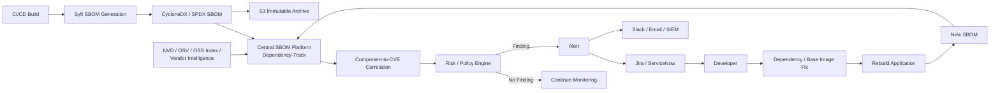
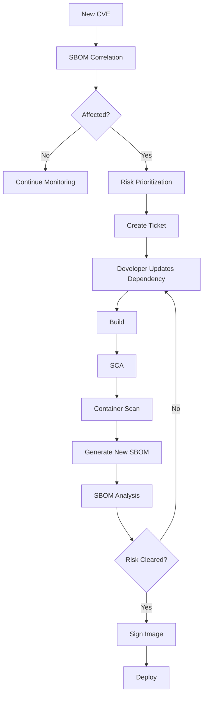

# SBOM Vulnerability Analysis Pipeline

## 1. Purpose

This pipeline addresses a problem that build-time SCA alone cannot completely solve:

> **A software artifact can become vulnerable after it has already passed CI/CD.**

A new CVE can be published weeks or months after an image was built.

The SBOM gives the organization a machine-readable inventory of what was shipped.

---

## 2. Architecture



---

## 3. Why SBOM Analysis Exists

Consider:

```text
January

Application
   |
   v
SCA
   |
   v
PASS
   |
   v
Image
   |
   v
SBOM
   |
   v
Production
```

Then in March:

```text
NEW CVE DISCLOSED
        |
        v
Affected component
        |
        v
Existing production image
        |
        v
SBOM identifies the component
        |
        v
Affected application identified
```

The application did not need to change for the vulnerability to become relevant.

---

## 4. SCA vs SBOM Analysis

| Control | Purpose |
|---|---|
| SCA | Identify vulnerable dependencies during development/build |
| Image scanning | Identify vulnerabilities in the built image |
| SBOM | Record the exact software composition |
| SBOM analysis | Continuously correlate known vulnerabilities with shipped components |

There can be overlap.

The enterprise value of SBOM analysis is **continuous inventory and exposure analysis**, not simply running the same scanner again.

---

## 5. SBOM Generation

Example:

```bash
syft payment-service:1.8.0 \
  -o cyclonedx-json=sbom.json
```

Result:

```text
sbom.json
```

Example conceptual content:

```json
{
  "bomFormat": "CycloneDX",
  "components": [
    {
      "name": "log4j-core",
      "version": "2.17.1"
    },
    {
      "name": "openssl",
      "version": "3.x"
    }
  ]
}
```

The actual SBOM contains substantially more metadata such as package identifiers, versions, hashes, licenses, and relationships.

---

## 6. Upload to Central Platform

For Dependency-Track, the CI pipeline can publish the CycloneDX SBOM through its API.

Conceptually:

```text
CI
 |
 v
sbom.json
 |
 v
Dependency-Track API
 |
 v
Project: payment-service
Version: 1.8.0
```

Dependency-Track maintains the component inventory and performs vulnerability analysis.

---

## 7. S3 Archive

An enterprise can additionally archive:

```text
s3://security-sbom/
    payment-service/
       1.7.0/sbom.json
       1.8.0/sbom.json
       1.9.0/sbom.json
```

Recommended controls:
- S3 versioning
- SSE-KMS
- Restricted IAM
- Bucket policies
- Object Lock where regulatory retention requires it
- CloudTrail data events where appropriate

---

## 8. Vulnerability Intelligence

The analysis platform needs vulnerability intelligence.

Conceptually:

```text
                  Vulnerability Intelligence
                           |
          +----------------+----------------+
          |                |                |
          v                v                v
         NVD              OSV          Vendor Advisories
          |                |                |
          +----------------+----------------+
                           |
                           v
                  Vulnerability Platform
                           |
                           v
                         SBOM
```

Sources and availability vary by product and configuration.

---

## 9. Continuous Re-evaluation

Monday:

```text
payment-service:1.8
        |
        v
SBOM
        |
        v
No known critical CVE
```

Wednesday:

```text
New CVE
   |
   v
Vulnerability intelligence updated
   |
   v
Existing components re-evaluated
   |
   v
payment-service:1.8
   |
   v
CRITICAL finding
```

This is the major value of continuous SBOM analysis.

---

## 10. Risk Prioritization

Do not prioritize only by CVSS.

Consider:

```text
Risk =
  Severity
+ Exploitability
+ Internet Exposure
+ Asset Criticality
+ Environment
+ Runtime Reachability
+ Compensating Controls
```

Example:

```text
CVSS: 9.8
+
Internet-facing API
+
Production
+
Known exploitation
=
P0 / Immediate remediation
```

Whereas:

```text
CVSS: 9.8
+
Unused development library
+
Non-production
+
Not reachable
=
Lower operational priority
```

The exact scoring model should follow organizational policy.

---

## 11. Alerting

Example:

```text
Dependency-Track
      |
      v
Critical CVE
      |
      +----> Jira / ServiceNow
      |
      +----> Slack / Teams
      |
      +----> Email
      |
      +----> SIEM
      |
      +----> Security Dashboard
```

The ticket should contain:

```text
Application
Version
Environment
Component
Current Version
Vulnerable Version Range
Fixed Version
CVE
Severity
CVSS
Evidence
Remediation
SLA
Owner
```

---

## 12. Remediation Loop



---

## 13. Important: The SBOM Tool Does Not Normally Fix the Vulnerability

For example:

```text
SBOM Analysis
     |
     v
log4j 2.14.1
     |
     v
CVE detected
     |
     v
Fixed version = 2.17.1
```

The tool reports the remediation.

The developer changes:

```text
pom.xml
```

Then the application is rebuilt.

---

## 14. Enterprise Scheduling Model

You can have both:

### Real-time / event-driven

```text
New SBOM
   |
   v
Immediate analysis
```

### Continuous monitoring

```text
New vulnerability intelligence
   |
   v
Re-evaluate existing inventory
```

### Periodic reconciliation

```text
Daily / weekly
   |
   v
Verify inventory consistency
```

Do not rely exclusively on a weekly scan for critical production exposure.

---

## 15. Build-Time vs Post-Deployment

### Build-time

```text
Developer
   |
   v
SCA
   |
   v
Image Scan
   |
   v
SBOM
   |
   v
Security Gate
```

Purpose:

> **Prevent vulnerable artifacts from being released.**

### Post-deployment

```text
Existing Production Image
          |
          v
       SBOM
          |
          v
Continuous Analysis
          |
          v
New CVE?
```

Purpose:

> **Detect newly discovered risk in artifacts that already exist.**

---

## 16. Enterprise Reference Stack

### Open-source stack

```text
Secret Scan      -> Gitleaks
SAST             -> Semgrep
SCA              -> OWASP Dependency-Check
Image Scan       -> Trivy
SBOM Generation  -> Syft
SBOM Analysis    -> Dependency-Track
Image Signing    -> Cosign
Admission        -> Kyverno / OPA Gatekeeper
GitOps            -> Argo CD
Runtime           -> Falco
```

### Commercial alternatives

```text
SCA/SBOM         -> Snyk / Black Duck / Mend / Sonatype
Container        -> Prisma Cloud / Aqua / Wiz
Registry         -> ECR / ACR / Artifact Registry
```

Use the organization's existing platform where possible rather than introducing overlapping tools unnecessarily.

---

## 17. The Most Important Interview Answer

> **"I separate build-time dependency security from post-build software inventory. SCA such as Dependency-Check helps prevent vulnerable application dependencies from entering the build. After producing the final container, I generate a CycloneDX or SPDX SBOM so we have an authoritative inventory of the artifact. I publish it to a centralized SBOM platform such as Dependency-Track and optionally archive it in S3. The platform correlates the component inventory with vulnerability intelligence and continuously re-evaluates existing artifacts. Therefore, if a new CVE is disclosed after deployment, I can identify affected applications without waiting for those applications to rebuild. Remediation then goes through the normal dependency/base-image update, rebuild, rescan, SBOM regeneration, signing, and deployment lifecycle."**

---

## 18. Final Mental Model

```text
             BUILD-TIME SECURITY
                     |
     +---------------+---------------+
     |               |               |
 Secret Scan        SAST            SCA
     |               |               |
     +---------------+---------------+
                     |
                   Build
                     |
               Docker Image
                     |
                Image Scan
                     |
                  SBOM
                     |
              Security Gate
                     |
                  Signing
                     |
                  Registry
                     |
                 Deployment
                     |
               Kubernetes
                     |
              PRODUCTION
                     |
                     v
            CONTINUOUS SBOM
               ANALYSIS
                     |
                New CVE?
                     |
                    YES
                     |
                  Alert
                     |
                  Ticket
                     |
                    Fix
                     |
                  Rebuild
                     |
                 Revalidate
```

**Core principle:**

> **SCA asks "Can I safely build this?"  
> Image scanning asks "Is this image vulnerable now?"  
> SBOM asks "What exactly did I ship?"  
> Continuous SBOM analysis asks "Did anything I shipped become vulnerable later?"**
